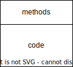
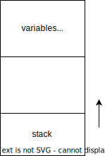

# Computer Science Architecture Lab 3

Рябоконь Архип Борисович P33302

## Вариант

'lisp | risc | harv | hw | tick | struct | stream | port | cstr | prob5'

* 'alg' - синтаксис языка Lisp. S-exp.
* 'risc' - система команд должна быть упрощенной, в духе RISC архитектур
* 'harv' - Гарвардская архитектура
* 'hw' - Control Unit реализован как часть модели, микрокода нет
* 'tick' - процессор необходимо моделировать с точностью до такта, процесс моделирования может быть приостановлен на любом такте.
* 'struct' - в виде высокоуровневой структуры данных. Одна инструкция укладывается в одно машинное слово
* 'stream' - ввод-вывод осуществляется как поток токенов
* 'port' - port-mapped
* 'prob5' - Project Euler. Problem 5

## Язык программирования

Использован язык Lisp с упрощениями

* Объявление присваивание переменных через функцию `setq`
* Доступен цикл `loop for`
* Доступна функция ввода `read` и функция вывода `print`
* Доступна инструкция ветвления `if`
* Разрешенные математические операции:
* `+` - бинарный плюс
* `-` -  бинарный минус
* `*` - умножение
* `%` - остаток от деления
* `!=`, `=`, `>=`, `>`, `<=`, `<` - операции сравнения 

## Язык программирования
```
program ::= s-expression* comment
comment ::= ";" <any symbols>
s_expression ::= atom / list
list ::= "(" function args ")"
function ::= "setq" / "read" / "print" / "loop" / "while" / "if" 
    / "+" / "-" / ">" / "<" / "=" / "!=" / "<=" / ">="
args ::= s_expression <s_expression> <s_expression>
atom ::= empty / word / number / var_name

word ::= '"' [a-z A-Z 1-9 \s]+ '"'
var_name ::= [a-zA-Z1-9]+
number ::= [-]?[0-9]+
empty ::=             
```

### Пример
```lisp
(setq welcome "What is your name?") 
(print welcome) 
(setq name (read)) 
(print name)
```

```lisp
(setq n 2520) (setq i 20) (setq x 0) 
(while (> i 0) 
(if (= (% n i) 0) (setq x 1) (setq i (- i 1))) 
(if (= x 1) (setq x 0) (setq i 20)) 
(if (= i 20) (setq x 0) (setq n (+ n 2520))) 
(if (= i 1) (setq x 0) (print n))
)
```
## Организация памяти

### Instruction Memory



### Data Memory



## Процессор

Реализован в модуле [machine.py](./machine.py)

Интерфейс командной строки с запуском модуля: `python machine.py <target_file> <input_file>`

### Модель процессора


Управляющие сигналы:
* Sel(rx1)  - выставить значение регистра rx1
  * 1 - увеличить на 1
  * 0 - загрузить значение из вне


### Организация памяти

Память инструкций и данных раделены на два модуля.
Доступ к памяти может осуществляться только через store/load инструкции согласно RISC-архитектуре

Модель памяти процессора:
* Память команд - Машинное слово не определено, реализация при помощи массива словарей
* Память данных - 32 бита, знаковое

Размер памяти данных - 2048
Размер памяти инструкций - 2048

В процессоре всего расположено 16 регистров.
Размер регистра - 32 бита.
* `rx0` - регистр, постоянно хранящий 0
* `rx1` - регистр текущей инструкции
* `rx2` - регистр текущей адресации в модуле памяти данных
* `rx3 - rx11` - регистры общего назначения
* `rx12` - указатель стека
* `rx13` - регистр, хранящий результат операции '/'
* `rx14` - регистр, хранящий результат операции '%'
* `rx15` - регистр для загрузки аргумента для прыжка

Присутствует два флага состояния на выходах АЛУ - Zero Flag и Negative Flag 

Адреса расположения данных в памяти определяются во время трансляции линейно от начала адресного пространства.

### Набор инструкций
| Синтаксис           | Кол-во тактов | Комментарий                                   |
|:--------------------|:--------------|:----------------------------------------------|
| `ld` (reg) (int)    | 4             | int -> reg                                    |
| `ld` (reg) rx2      | 4             | data_mem[rx2] -> reg                          |
| `wr` (reg)          | 4             | reg -> data_mem[rx2]                          |
| `add` (reg1) (reg2) | 4             | reg1 + reg2 -> reg1                           |
| `sub` (reg1) (reg2) | 4             | reg1 - reg2 -> reg1                           |
| `mul` (reg1) (reg2) | 4             | reg1 * reg2 -> reg1                           |
| `div` (reg1) (reg2) | 4             | reg1 / reg2 -> rx13<br/>reg1 % reg2 -> rx14   |
| `input`             | 4             | i_buf -> data_mem[rx2]                        |
| `print` (reg) (1/0) | 3             | reg -> o_buf<br/>ch(reg) -> o_buf             |
| `jmp`               | 2             | rx15 -> rx1                                   |
| `inc` (reg)         | 4             | reg + 1 -> reg                                |
| `dec` (reg)         | 4             | reg - 1 -> reg                                |
| `jle` (reg1) (reg2) | 4             | zero_flag OR neg_flag => rx15 -> rx1          |
| `jl` (reg1) (reg2)  | 4             | NOT zero_flag AND neg_flag => rx15 -> rx1     |
| `jne` (reg1) (reg2) | 4             | NOT zero_flag  => rx15 -> rx1                 |
| `je` (reg1) (reg2)  | 4             | zero_flag  => rx15 -> rx1                     |
| `jge` (reg1) (reg2) | 4             | zero_flag OR NOT neg_flag => rx15 -> rx1      |
| `jg` (reg1) (reg2)  | 4             | NOT zero_flag AND NOT neg_flag => rx15 -> rx1 |
| `hlt`               | 1             |                                               |

Устройства ввода/вывода определены как два буфера данных, условно относящиеся к определенному порту

## Кодирование 

### Структура команды

* Машинный код представлен в формате JSON списка операционных команд
* Одна инструкция - словарь, содаержащий операционный код и аргументы

```json
{
    "opcode": "ld",
    "arg1": "rx15",
    "arg2": 75
}
```

* `opcode` - код операции
* `arg1` - первый аргумент (может отсутствовать) 
* `arg2` - второй аргумент аргумент (может отсутствовать)

### Транслятор

Реализован в модуле [translator.py](./translator.py)

Интерфейс командной строки с запуском модуля: `python translator.py <source_file> <target_file>`

Этапы трансляции:
* Загрузка исходного кода
* Парсинг
* Построение алгоритма работы программы
* Трансляция кода
* Выгрузка алгоритма в конечный файл

Пример:

```lisp
(setq hello "Hello, world!") (print hello)
```

```json
[
    {
        "opcode": "ld",
        "arg1": "rx3",
        "arg2": 72
    },
    {
        "opcode": "wr",
        "arg1": "rx3"
    },
    {
        "opcode": "ld",
        "arg1": "rx4",
        "arg2": 101
    },
    {
        "opcode": "wr",
        "arg1": "rx4"
    },
    {
        "opcode": "ld",
        "arg1": "rx5",
        "arg2": 108
    },
    {
        "opcode": "wr",
        "arg1": "rx5"
    },
    {
        "opcode": "ld",
        "arg1": "rx6",
        "arg2": 108
    },
    {
        "opcode": "wr",
        "arg1": "rx6"
    },
    {
        "opcode": "ld",
        "arg1": "rx7",
        "arg2": 111
    },
    {
        "opcode": "wr",
        "arg1": "rx7"
    },
    {
        "opcode": "ld",
        "arg1": "rx8",
        "arg2": 44
    },
    {
        "opcode": "wr",
        "arg1": "rx8"
    },
    {
        "opcode": "ld",
        "arg1": "rx9",
        "arg2": 32
    },
    {
        "opcode": "wr",
        "arg1": "rx9"
    },
    {
        "opcode": "ld",
        "arg1": "rx10",
        "arg2": 119
    },
    {
        "opcode": "wr",
        "arg1": "rx10"
    },
    {
        "opcode": "ld",
        "arg1": "rx11",
        "arg2": 111
    },
    {
        "opcode": "wr",
        "arg1": "rx11"
    },
    {
        "opcode": "ld",
        "arg1": "rx3",
        "arg2": 114
    },
    {
        "opcode": "wr",
        "arg1": "rx3"
    },
    {
        "opcode": "ld",
        "arg1": "rx4",
        "arg2": 108
    },
    {
        "opcode": "wr",
        "arg1": "rx4"
    },
    {
        "opcode": "ld",
        "arg1": "rx5",
        "arg2": 100
    },
    {
        "opcode": "wr",
        "arg1": "rx5"
    },
    {
        "opcode": "ld",
        "arg1": "rx6",
        "arg2": 33
    },
    {
        "opcode": "wr",
        "arg1": "rx6"
    },
    {
        "opcode": "ld",
        "arg1": "rx7",
        "arg2": 0
    },
    {
        "opcode": "wr",
        "arg1": "rx7"
    },
    {
        "opcode": "ld",
        "arg1": "rx2",
        "arg2": 0
    },
    {
        "opcode": "ld",
        "arg1": "rx15",
        "arg2": 36
    },
    {
        "opcode": "ld",
        "arg1": "rx8",
        "arg2": "rx2"
    },
    {
        "opcode": "je",
        "arg1": "rx8",
        "arg2": "rx0"
    },
    {
        "opcode": "print",
        "arg1": "rx8",
        "arg2": 1
    },
    {
        "opcode": "inc",
        "arg1": "rx2"
    },
    {
        "opcode": "ld",
        "arg1": "rx15",
        "arg2": 29
    },
    {
        "opcode": "jmp"
    },
    {
        "opcode": "halt"
    }
]
```

## Аппробация

* Исходные коды готовых программ
  * [cat.js](./tests/cat.txt)
  * [prob5.txt](./tests/prob5.txt)
  * [hello_test.txt](./tests/hello_test.txt)
  * [hello_user_name.txt](./tests/hello_user_name.txt)
* Результаты работы транслятора
  * [cat.out](./tests/cat.out) 
  * [prob5.out](./tests/prob5.out)
  * [hello_test.out](./tests/hello_test.out)
  * [hello_user_name.out](./tests/hello_user_name.out)
* Входные данные для программ
  * [hello_input.txt](./tests/hello_input.txt)
  * [hello_user_input.txt](./tests/hello_user_input.txt)

Описание тестов - [integration_tests.py](./integration_tests.py)

Пример запуска теста:
```shell
> ./translator.py ./tests/hello_test.txt ./tests/hello_test.out
> ./machine.py ./tests/hello_test.out ./hello_input.txt

  DEBUG    root:machine.py:130 {TICK: 1, RX1: 0, RX2: 0, RX3: 0, RX4: 0, RX5: 0, RX6: 0, RX7: 0, RX8: 0, RX9: 0, RX10: 0, RX11: 0, RX12: 2047, RX13: 0, RX14: 0, RX15: 0}
  DEBUG    root:machine.py:130 {TICK: 2, RX1: 0, RX2: 0, RX3: 72, RX4: 0, RX5: 0, RX6: 0, RX7: 0, RX8: 0, RX9: 0, RX10: 0, RX11: 0, RX12: 2047, RX13: 0, RX14: 0, RX15: 0}
  DEBUG    root:machine.py:130 {TICK: 3, RX1: 0, RX2: 0, RX3: 72, RX4: 0, RX5: 0, RX6: 0, RX7: 0, RX8: 0, RX9: 0, RX10: 0, RX11: 0, RX12: 2047, RX13: 0, RX14: 0, RX15: 0}
  DEBUG    root:machine.py:130 {TICK: 4, RX1: 1, RX2: 0, RX3: 72, RX4: 0, RX5: 0, RX6: 0, RX7: 0, RX8: 0, RX9: 0, RX10: 0, RX11: 0, RX12: 2047, RX13: 0, RX14: 0, RX15: 0}
  DEBUG    root:machine.py:130 {TICK: 5, RX1: 1, RX2: 0, RX3: 72, RX4: 0, RX5: 0, RX6: 0, RX7: 0, RX8: 0, RX9: 0, RX10: 0, RX11: 0, RX12: 2047, RX13: 0, RX14: 0, RX15: 0}
  DEBUG    root:machine.py:130 {TICK: 6, RX1: 1, RX2: 1, RX3: 72, RX4: 0, RX5: 0, RX6: 0, RX7: 0, RX8: 0, RX9: 0, RX10: 0, RX11: 0, RX12: 2047, RX13: 0, RX14: 0, RX15: 0}
  DEBUG    root:machine.py:130 {TICK: 7, RX1: 1, RX2: 1, RX3: 72, RX4: 0, RX5: 0, RX6: 0, RX7: 0, RX8: 0, RX9: 0, RX10: 0, RX11: 0, RX12: 2047, RX13: 0, RX14: 0, RX15: 0}
  DEBUG    root:machine.py:130 {TICK: 8, RX1: 2, RX2: 1, RX3: 72, RX4: 0, RX5: 0, RX6: 0, RX7: 0, RX8: 0, RX9: 0, RX10: 0, RX11: 0, RX12: 2047, RX13: 0, RX14: 0, RX15: 0}
  DEBUG    root:machine.py:130 {TICK: 9, RX1: 2, RX2: 1, RX3: 72, RX4: 0, RX5: 0, RX6: 0, RX7: 0, RX8: 0, RX9: 0, RX10: 0, RX11: 0, RX12: 2047, RX13: 0, RX14: 0, RX15: 0}
  DEBUG    root:machine.py:130 {TICK: 10, RX1: 2, RX2: 1, RX3: 72, RX4: 101, RX5: 0, RX6: 0, RX7: 0, RX8: 0, RX9: 0, RX10: 0, RX11: 0, RX12: 2047, RX13: 0, RX14: 0, RX15: 0}
  DEBUG    root:machine.py:130 {TICK: 11, RX1: 2, RX2: 1, RX3: 72, RX4: 101, RX5: 0, RX6: 0, RX7: 0, RX8: 0, RX9: 0, RX10: 0, RX11: 0, RX12: 2047, RX13: 0, RX14: 0, RX15: 0}
  DEBUG    root:machine.py:130 {TICK: 12, RX1: 3, RX2: 1, RX3: 72, RX4: 101, RX5: 0, RX6: 0, RX7: 0, RX8: 0, RX9: 0, RX10: 0, RX11: 0, RX12: 2047, RX13: 0, RX14: 0, RX15: 0}
  DEBUG    root:machine.py:130 {TICK: 13, RX1: 3, RX2: 1, RX3: 72, RX4: 101, RX5: 0, RX6: 0, RX7: 0, RX8: 0, RX9: 0, RX10: 0, RX11: 0, RX12: 2047, RX13: 0, RX14: 0, RX15: 0}
  DEBUG    root:machine.py:130 {TICK: 14, RX1: 3, RX2: 2, RX3: 72, RX4: 101, RX5: 0, RX6: 0, RX7: 0, RX8: 0, RX9: 0, RX10: 0, RX11: 0, RX12: 2047, RX13: 0, RX14: 0, RX15: 0}
  DEBUG    root:machine.py:130 {TICK: 15, RX1: 3, RX2: 2, RX3: 72, RX4: 101, RX5: 0, RX6: 0, RX7: 0, RX8: 0, RX9: 0, RX10: 0, RX11: 0, RX12: 2047, RX13: 0, RX14: 0, RX15: 0}
  DEBUG    root:machine.py:130 {TICK: 16, RX1: 4, RX2: 2, RX3: 72, RX4: 101, RX5: 0, RX6: 0, RX7: 0, RX8: 0, RX9: 0, RX10: 0, RX11: 0, RX12: 2047, RX13: 0, RX14: 0, RX15: 0}
  DEBUG    root:machine.py:130 {TICK: 17, RX1: 4, RX2: 2, RX3: 72, RX4: 101, RX5: 0, RX6: 0, RX7: 0, RX8: 0, RX9: 0, RX10: 0, RX11: 0, RX12: 2047, RX13: 0, RX14: 0, RX15: 0}
  DEBUG    root:machine.py:130 {TICK: 18, RX1: 4, RX2: 2, RX3: 72, RX4: 101, RX5: 108, RX6: 0, RX7: 0, RX8: 0, RX9: 0, RX10: 0, RX11: 0, RX12: 2047, RX13: 0, RX14: 0, RX15: 0}
  DEBUG    root:machine.py:130 {TICK: 19, RX1: 4, RX2: 2, RX3: 72, RX4: 101, RX5: 108, RX6: 0, RX7: 0, RX8: 0, RX9: 0, RX10: 0, RX11: 0, RX12: 2047, RX13: 0, RX14: 0, RX15: 0}
  DEBUG    root:machine.py:130 {TICK: 20, RX1: 5, RX2: 2, RX3: 72, RX4: 101, RX5: 108, RX6: 0, RX7: 0, RX8: 0, RX9: 0, RX10: 0, RX11: 0, RX12: 2047, RX13: 0, RX14: 0, RX15: 0}
  DEBUG    root:machine.py:130 {TICK: 21, RX1: 5, RX2: 2, RX3: 72, RX4: 101, RX5: 108, RX6: 0, RX7: 0, RX8: 0, RX9: 0, RX10: 0, RX11: 0, RX12: 2047, RX13: 0, RX14: 0, RX15: 0}
  DEBUG    root:machine.py:130 {TICK: 22, RX1: 5, RX2: 3, RX3: 72, RX4: 101, RX5: 108, RX6: 0, RX7: 0, RX8: 0, RX9: 0, RX10: 0, RX11: 0, RX12: 2047, RX13: 0, RX14: 0, RX15: 0}
  DEBUG    root:machine.py:130 {TICK: 23, RX1: 5, RX2: 3, RX3: 72, RX4: 101, RX5: 108, RX6: 0, RX7: 0, RX8: 0, RX9: 0, RX10: 0, RX11: 0, RX12: 2047, RX13: 0, RX14: 0, RX15: 0}
  DEBUG    root:machine.py:130 {TICK: 24, RX1: 6, RX2: 3, RX3: 72, RX4: 101, RX5: 108, RX6: 0, RX7: 0, RX8: 0, RX9: 0, RX10: 0, RX11: 0, RX12: 2047, RX13: 0, RX14: 0, RX15: 0}
  DEBUG    root:machine.py:130 {TICK: 25, RX1: 6, RX2: 3, RX3: 72, RX4: 101, RX5: 108, RX6: 0, RX7: 0, RX8: 0, RX9: 0, RX10: 0, RX11: 0, RX12: 2047, RX13: 0, RX14: 0, RX15: 0}
  DEBUG    root:machine.py:130 {TICK: 26, RX1: 6, RX2: 3, RX3: 72, RX4: 101, RX5: 108, RX6: 108, RX7: 0, RX8: 0, RX9: 0, RX10: 0, RX11: 0, RX12: 2047, RX13: 0, RX14: 0, RX15: 0}
  DEBUG    root:machine.py:130 {TICK: 27, RX1: 6, RX2: 3, RX3: 72, RX4: 101, RX5: 108, RX6: 108, RX7: 0, RX8: 0, RX9: 0, RX10: 0, RX11: 0, RX12: 2047, RX13: 0, RX14: 0, RX15: 0}
  DEBUG    root:machine.py:130 {TICK: 28, RX1: 7, RX2: 3, RX3: 72, RX4: 101, RX5: 108, RX6: 108, RX7: 0, RX8: 0, RX9: 0, RX10: 0, RX11: 0, RX12: 2047, RX13: 0, RX14: 0, RX15: 0}
  DEBUG    root:machine.py:130 {TICK: 29, RX1: 7, RX2: 3, RX3: 72, RX4: 101, RX5: 108, RX6: 108, RX7: 0, RX8: 0, RX9: 0, RX10: 0, RX11: 0, RX12: 2047, RX13: 0, RX14: 0, RX15: 0}
  DEBUG    root:machine.py:130 {TICK: 30, RX1: 7, RX2: 4, RX3: 72, RX4: 101, RX5: 108, RX6: 108, RX7: 0, RX8: 0, RX9: 0, RX10: 0, RX11: 0, RX12: 2047, RX13: 0, RX14: 0, RX15: 0}
  DEBUG    root:machine.py:130 {TICK: 31, RX1: 7, RX2: 4, RX3: 72, RX4: 101, RX5: 108, RX6: 108, RX7: 0, RX8: 0, RX9: 0, RX10: 0, RX11: 0, RX12: 2047, RX13: 0, RX14: 0, RX15: 0}
  DEBUG    root:machine.py:130 {TICK: 32, RX1: 8, RX2: 4, RX3: 72, RX4: 101, RX5: 108, RX6: 108, RX7: 0, RX8: 0, RX9: 0, RX10: 0, RX11: 0, RX12: 2047, RX13: 0, RX14: 0, RX15: 0}
  DEBUG    root:machine.py:130 {TICK: 33, RX1: 8, RX2: 4, RX3: 72, RX4: 101, RX5: 108, RX6: 108, RX7: 0, RX8: 0, RX9: 0, RX10: 0, RX11: 0, RX12: 2047, RX13: 0, RX14: 0, RX15: 0}
  DEBUG    root:machine.py:130 {TICK: 34, RX1: 8, RX2: 4, RX3: 72, RX4: 101, RX5: 108, RX6: 108, RX7: 111, RX8: 0, RX9: 0, RX10: 0, RX11: 0, RX12: 2047, RX13: 0, RX14: 0, RX15: 0}
  DEBUG    root:machine.py:130 {TICK: 35, RX1: 8, RX2: 4, RX3: 72, RX4: 101, RX5: 108, RX6: 108, RX7: 111, RX8: 0, RX9: 0, RX10: 0, RX11: 0, RX12: 2047, RX13: 0, RX14: 0, RX15: 0}
  DEBUG    root:machine.py:130 {TICK: 36, RX1: 9, RX2: 4, RX3: 72, RX4: 101, RX5: 108, RX6: 108, RX7: 111, RX8: 0, RX9: 0, RX10: 0, RX11: 0, RX12: 2047, RX13: 0, RX14: 0, RX15: 0}
  DEBUG    root:machine.py:130 {TICK: 37, RX1: 9, RX2: 4, RX3: 72, RX4: 101, RX5: 108, RX6: 108, RX7: 111, RX8: 0, RX9: 0, RX10: 0, RX11: 0, RX12: 2047, RX13: 0, RX14: 0, RX15: 0}
  DEBUG    root:machine.py:130 {TICK: 38, RX1: 9, RX2: 5, RX3: 72, RX4: 101, RX5: 108, RX6: 108, RX7: 111, RX8: 0, RX9: 0, RX10: 0, RX11: 0, RX12: 2047, RX13: 0, RX14: 0, RX15: 0}
  DEBUG    root:machine.py:130 {TICK: 39, RX1: 9, RX2: 5, RX3: 72, RX4: 101, RX5: 108, RX6: 108, RX7: 111, RX8: 0, RX9: 0, RX10: 0, RX11: 0, RX12: 2047, RX13: 0, RX14: 0, RX15: 0}
  DEBUG    root:machine.py:130 {TICK: 40, RX1: 10, RX2: 5, RX3: 72, RX4: 101, RX5: 108, RX6: 108, RX7: 111, RX8: 0, RX9: 0, RX10: 0, RX11: 0, RX12: 2047, RX13: 0, RX14: 0, RX15: 0}
  DEBUG    root:machine.py:130 {TICK: 41, RX1: 10, RX2: 5, RX3: 72, RX4: 101, RX5: 108, RX6: 108, RX7: 111, RX8: 0, RX9: 0, RX10: 0, RX11: 0, RX12: 2047, RX13: 0, RX14: 0, RX15: 0}
  DEBUG    root:machine.py:130 {TICK: 42, RX1: 10, RX2: 5, RX3: 72, RX4: 101, RX5: 108, RX6: 108, RX7: 111, RX8: 44, RX9: 0, RX10: 0, RX11: 0, RX12: 2047, RX13: 0, RX14: 0, RX15: 0}
  DEBUG    root:machine.py:130 {TICK: 43, RX1: 10, RX2: 5, RX3: 72, RX4: 101, RX5: 108, RX6: 108, RX7: 111, RX8: 44, RX9: 0, RX10: 0, RX11: 0, RX12: 2047, RX13: 0, RX14: 0, RX15: 0}
  DEBUG    root:machine.py:130 {TICK: 44, RX1: 11, RX2: 5, RX3: 72, RX4: 101, RX5: 108, RX6: 108, RX7: 111, RX8: 44, RX9: 0, RX10: 0, RX11: 0, RX12: 2047, RX13: 0, RX14: 0, RX15: 0}
  DEBUG    root:machine.py:130 {TICK: 45, RX1: 11, RX2: 5, RX3: 72, RX4: 101, RX5: 108, RX6: 108, RX7: 111, RX8: 44, RX9: 0, RX10: 0, RX11: 0, RX12: 2047, RX13: 0, RX14: 0, RX15: 0}
  DEBUG    root:machine.py:130 {TICK: 46, RX1: 11, RX2: 6, RX3: 72, RX4: 101, RX5: 108, RX6: 108, RX7: 111, RX8: 44, RX9: 0, RX10: 0, RX11: 0, RX12: 2047, RX13: 0, RX14: 0, RX15: 0}
  DEBUG    root:machine.py:130 {TICK: 47, RX1: 11, RX2: 6, RX3: 72, RX4: 101, RX5: 108, RX6: 108, RX7: 111, RX8: 44, RX9: 0, RX10: 0, RX11: 0, RX12: 2047, RX13: 0, RX14: 0, RX15: 0}
  DEBUG    root:machine.py:130 {TICK: 48, RX1: 12, RX2: 6, RX3: 72, RX4: 101, RX5: 108, RX6: 108, RX7: 111, RX8: 44, RX9: 0, RX10: 0, RX11: 0, RX12: 2047, RX13: 0, RX14: 0, RX15: 0}
  DEBUG    root:machine.py:130 {TICK: 49, RX1: 12, RX2: 6, RX3: 72, RX4: 101, RX5: 108, RX6: 108, RX7: 111, RX8: 44, RX9: 0, RX10: 0, RX11: 0, RX12: 2047, RX13: 0, RX14: 0, RX15: 0}
  DEBUG    root:machine.py:130 {TICK: 50, RX1: 12, RX2: 6, RX3: 72, RX4: 101, RX5: 108, RX6: 108, RX7: 111, RX8: 44, RX9: 32, RX10: 0, RX11: 0, RX12: 2047, RX13: 0, RX14: 0, RX15: 0}
  DEBUG    root:machine.py:130 {TICK: 51, RX1: 12, RX2: 6, RX3: 72, RX4: 101, RX5: 108, RX6: 108, RX7: 111, RX8: 44, RX9: 32, RX10: 0, RX11: 0, RX12: 2047, RX13: 0, RX14: 0, RX15: 0}
  DEBUG    root:machine.py:130 {TICK: 52, RX1: 13, RX2: 6, RX3: 72, RX4: 101, RX5: 108, RX6: 108, RX7: 111, RX8: 44, RX9: 32, RX10: 0, RX11: 0, RX12: 2047, RX13: 0, RX14: 0, RX15: 0}
  DEBUG    root:machine.py:130 {TICK: 53, RX1: 13, RX2: 6, RX3: 72, RX4: 101, RX5: 108, RX6: 108, RX7: 111, RX8: 44, RX9: 32, RX10: 0, RX11: 0, RX12: 2047, RX13: 0, RX14: 0, RX15: 0}
  DEBUG    root:machine.py:130 {TICK: 54, RX1: 13, RX2: 7, RX3: 72, RX4: 101, RX5: 108, RX6: 108, RX7: 111, RX8: 44, RX9: 32, RX10: 0, RX11: 0, RX12: 2047, RX13: 0, RX14: 0, RX15: 0}
  DEBUG    root:machine.py:130 {TICK: 55, RX1: 13, RX2: 7, RX3: 72, RX4: 101, RX5: 108, RX6: 108, RX7: 111, RX8: 44, RX9: 32, RX10: 0, RX11: 0, RX12: 2047, RX13: 0, RX14: 0, RX15: 0}
  DEBUG    root:machine.py:130 {TICK: 56, RX1: 14, RX2: 7, RX3: 72, RX4: 101, RX5: 108, RX6: 108, RX7: 111, RX8: 44, RX9: 32, RX10: 0, RX11: 0, RX12: 2047, RX13: 0, RX14: 0, RX15: 0}
  DEBUG    root:machine.py:130 {TICK: 57, RX1: 14, RX2: 7, RX3: 72, RX4: 101, RX5: 108, RX6: 108, RX7: 111, RX8: 44, RX9: 32, RX10: 0, RX11: 0, RX12: 2047, RX13: 0, RX14: 0, RX15: 0}
  DEBUG    root:machine.py:130 {TICK: 58, RX1: 14, RX2: 7, RX3: 72, RX4: 101, RX5: 108, RX6: 108, RX7: 111, RX8: 44, RX9: 32, RX10: 119, RX11: 0, RX12: 2047, RX13: 0, RX14: 0, RX15: 0}
  DEBUG    root:machine.py:130 {TICK: 59, RX1: 14, RX2: 7, RX3: 72, RX4: 101, RX5: 108, RX6: 108, RX7: 111, RX8: 44, RX9: 32, RX10: 119, RX11: 0, RX12: 2047, RX13: 0, RX14: 0, RX15: 0}
  DEBUG    root:machine.py:130 {TICK: 60, RX1: 15, RX2: 7, RX3: 72, RX4: 101, RX5: 108, RX6: 108, RX7: 111, RX8: 44, RX9: 32, RX10: 119, RX11: 0, RX12: 2047, RX13: 0, RX14: 0, RX15: 0}
  DEBUG    root:machine.py:130 {TICK: 61, RX1: 15, RX2: 7, RX3: 72, RX4: 101, RX5: 108, RX6: 108, RX7: 111, RX8: 44, RX9: 32, RX10: 119, RX11: 0, RX12: 2047, RX13: 0, RX14: 0, RX15: 0}
  DEBUG    root:machine.py:130 {TICK: 62, RX1: 15, RX2: 8, RX3: 72, RX4: 101, RX5: 108, RX6: 108, RX7: 111, RX8: 44, RX9: 32, RX10: 119, RX11: 0, RX12: 2047, RX13: 0, RX14: 0, RX15: 0}
  DEBUG    root:machine.py:130 {TICK: 63, RX1: 15, RX2: 8, RX3: 72, RX4: 101, RX5: 108, RX6: 108, RX7: 111, RX8: 44, RX9: 32, RX10: 119, RX11: 0, RX12: 2047, RX13: 0, RX14: 0, RX15: 0}
  DEBUG    root:machine.py:130 {TICK: 64, RX1: 16, RX2: 8, RX3: 72, RX4: 101, RX5: 108, RX6: 108, RX7: 111, RX8: 44, RX9: 32, RX10: 119, RX11: 0, RX12: 2047, RX13: 0, RX14: 0, RX15: 0}
  DEBUG    root:machine.py:130 {TICK: 65, RX1: 16, RX2: 8, RX3: 72, RX4: 101, RX5: 108, RX6: 108, RX7: 111, RX8: 44, RX9: 32, RX10: 119, RX11: 0, RX12: 2047, RX13: 0, RX14: 0, RX15: 0}
  DEBUG    root:machine.py:130 {TICK: 66, RX1: 16, RX2: 8, RX3: 72, RX4: 101, RX5: 108, RX6: 108, RX7: 111, RX8: 44, RX9: 32, RX10: 119, RX11: 111, RX12: 2047, RX13: 0, RX14: 0, RX15: 0}
  DEBUG    root:machine.py:130 {TICK: 67, RX1: 16, RX2: 8, RX3: 72, RX4: 101, RX5: 108, RX6: 108, RX7: 111, RX8: 44, RX9: 32, RX10: 119, RX11: 111, RX12: 2047, RX13: 0, RX14: 0, RX15: 0}
  DEBUG    root:machine.py:130 {TICK: 68, RX1: 17, RX2: 8, RX3: 72, RX4: 101, RX5: 108, RX6: 108, RX7: 111, RX8: 44, RX9: 32, RX10: 119, RX11: 111, RX12: 2047, RX13: 0, RX14: 0, RX15: 0}
  DEBUG    root:machine.py:130 {TICK: 69, RX1: 17, RX2: 8, RX3: 72, RX4: 101, RX5: 108, RX6: 108, RX7: 111, RX8: 44, RX9: 32, RX10: 119, RX11: 111, RX12: 2047, RX13: 0, RX14: 0, RX15: 0}
  DEBUG    root:machine.py:130 {TICK: 70, RX1: 17, RX2: 9, RX3: 72, RX4: 101, RX5: 108, RX6: 108, RX7: 111, RX8: 44, RX9: 32, RX10: 119, RX11: 111, RX12: 2047, RX13: 0, RX14: 0, RX15: 0}
  DEBUG    root:machine.py:130 {TICK: 71, RX1: 17, RX2: 9, RX3: 72, RX4: 101, RX5: 108, RX6: 108, RX7: 111, RX8: 44, RX9: 32, RX10: 119, RX11: 111, RX12: 2047, RX13: 0, RX14: 0, RX15: 0}
  DEBUG    root:machine.py:130 {TICK: 72, RX1: 18, RX2: 9, RX3: 72, RX4: 101, RX5: 108, RX6: 108, RX7: 111, RX8: 44, RX9: 32, RX10: 119, RX11: 111, RX12: 2047, RX13: 0, RX14: 0, RX15: 0}
  DEBUG    root:machine.py:130 {TICK: 73, RX1: 18, RX2: 9, RX3: 72, RX4: 101, RX5: 108, RX6: 108, RX7: 111, RX8: 44, RX9: 32, RX10: 119, RX11: 111, RX12: 2047, RX13: 0, RX14: 0, RX15: 0}
  DEBUG    root:machine.py:130 {TICK: 74, RX1: 18, RX2: 9, RX3: 114, RX4: 101, RX5: 108, RX6: 108, RX7: 111, RX8: 44, RX9: 32, RX10: 119, RX11: 111, RX12: 2047, RX13: 0, RX14: 0, RX15: 0}
  DEBUG    root:machine.py:130 {TICK: 75, RX1: 18, RX2: 9, RX3: 114, RX4: 101, RX5: 108, RX6: 108, RX7: 111, RX8: 44, RX9: 32, RX10: 119, RX11: 111, RX12: 2047, RX13: 0, RX14: 0, RX15: 0}
  DEBUG    root:machine.py:130 {TICK: 76, RX1: 19, RX2: 9, RX3: 114, RX4: 101, RX5: 108, RX6: 108, RX7: 111, RX8: 44, RX9: 32, RX10: 119, RX11: 111, RX12: 2047, RX13: 0, RX14: 0, RX15: 0}
  DEBUG    root:machine.py:130 {TICK: 77, RX1: 19, RX2: 9, RX3: 114, RX4: 101, RX5: 108, RX6: 108, RX7: 111, RX8: 44, RX9: 32, RX10: 119, RX11: 111, RX12: 2047, RX13: 0, RX14: 0, RX15: 0}
  DEBUG    root:machine.py:130 {TICK: 78, RX1: 19, RX2: 10, RX3: 114, RX4: 101, RX5: 108, RX6: 108, RX7: 111, RX8: 44, RX9: 32, RX10: 119, RX11: 111, RX12: 2047, RX13: 0, RX14: 0, RX15: 0}
  DEBUG    root:machine.py:130 {TICK: 79, RX1: 19, RX2: 10, RX3: 114, RX4: 101, RX5: 108, RX6: 108, RX7: 111, RX8: 44, RX9: 32, RX10: 119, RX11: 111, RX12: 2047, RX13: 0, RX14: 0, RX15: 0}
  DEBUG    root:machine.py:130 {TICK: 80, RX1: 20, RX2: 10, RX3: 114, RX4: 101, RX5: 108, RX6: 108, RX7: 111, RX8: 44, RX9: 32, RX10: 119, RX11: 111, RX12: 2047, RX13: 0, RX14: 0, RX15: 0}
  DEBUG    root:machine.py:130 {TICK: 81, RX1: 20, RX2: 10, RX3: 114, RX4: 101, RX5: 108, RX6: 108, RX7: 111, RX8: 44, RX9: 32, RX10: 119, RX11: 111, RX12: 2047, RX13: 0, RX14: 0, RX15: 0}
  DEBUG    root:machine.py:130 {TICK: 82, RX1: 20, RX2: 10, RX3: 114, RX4: 108, RX5: 108, RX6: 108, RX7: 111, RX8: 44, RX9: 32, RX10: 119, RX11: 111, RX12: 2047, RX13: 0, RX14: 0, RX15: 0}
  DEBUG    root:machine.py:130 {TICK: 83, RX1: 20, RX2: 10, RX3: 114, RX4: 108, RX5: 108, RX6: 108, RX7: 111, RX8: 44, RX9: 32, RX10: 119, RX11: 111, RX12: 2047, RX13: 0, RX14: 0, RX15: 0}
  DEBUG    root:machine.py:130 {TICK: 84, RX1: 21, RX2: 10, RX3: 114, RX4: 108, RX5: 108, RX6: 108, RX7: 111, RX8: 44, RX9: 32, RX10: 119, RX11: 111, RX12: 2047, RX13: 0, RX14: 0, RX15: 0}
  DEBUG    root:machine.py:130 {TICK: 85, RX1: 21, RX2: 10, RX3: 114, RX4: 108, RX5: 108, RX6: 108, RX7: 111, RX8: 44, RX9: 32, RX10: 119, RX11: 111, RX12: 2047, RX13: 0, RX14: 0, RX15: 0}
  DEBUG    root:machine.py:130 {TICK: 86, RX1: 21, RX2: 11, RX3: 114, RX4: 108, RX5: 108, RX6: 108, RX7: 111, RX8: 44, RX9: 32, RX10: 119, RX11: 111, RX12: 2047, RX13: 0, RX14: 0, RX15: 0}
  DEBUG    root:machine.py:130 {TICK: 87, RX1: 21, RX2: 11, RX3: 114, RX4: 108, RX5: 108, RX6: 108, RX7: 111, RX8: 44, RX9: 32, RX10: 119, RX11: 111, RX12: 2047, RX13: 0, RX14: 0, RX15: 0}
  DEBUG    root:machine.py:130 {TICK: 88, RX1: 22, RX2: 11, RX3: 114, RX4: 108, RX5: 108, RX6: 108, RX7: 111, RX8: 44, RX9: 32, RX10: 119, RX11: 111, RX12: 2047, RX13: 0, RX14: 0, RX15: 0}
  DEBUG    root:machine.py:130 {TICK: 89, RX1: 22, RX2: 11, RX3: 114, RX4: 108, RX5: 108, RX6: 108, RX7: 111, RX8: 44, RX9: 32, RX10: 119, RX11: 111, RX12: 2047, RX13: 0, RX14: 0, RX15: 0}
  DEBUG    root:machine.py:130 {TICK: 90, RX1: 22, RX2: 11, RX3: 114, RX4: 108, RX5: 100, RX6: 108, RX7: 111, RX8: 44, RX9: 32, RX10: 119, RX11: 111, RX12: 2047, RX13: 0, RX14: 0, RX15: 0}
  DEBUG    root:machine.py:130 {TICK: 91, RX1: 22, RX2: 11, RX3: 114, RX4: 108, RX5: 100, RX6: 108, RX7: 111, RX8: 44, RX9: 32, RX10: 119, RX11: 111, RX12: 2047, RX13: 0, RX14: 0, RX15: 0}
  DEBUG    root:machine.py:130 {TICK: 92, RX1: 23, RX2: 11, RX3: 114, RX4: 108, RX5: 100, RX6: 108, RX7: 111, RX8: 44, RX9: 32, RX10: 119, RX11: 111, RX12: 2047, RX13: 0, RX14: 0, RX15: 0}
  DEBUG    root:machine.py:130 {TICK: 93, RX1: 23, RX2: 11, RX3: 114, RX4: 108, RX5: 100, RX6: 108, RX7: 111, RX8: 44, RX9: 32, RX10: 119, RX11: 111, RX12: 2047, RX13: 0, RX14: 0, RX15: 0}
  DEBUG    root:machine.py:130 {TICK: 94, RX1: 23, RX2: 12, RX3: 114, RX4: 108, RX5: 100, RX6: 108, RX7: 111, RX8: 44, RX9: 32, RX10: 119, RX11: 111, RX12: 2047, RX13: 0, RX14: 0, RX15: 0}
  DEBUG    root:machine.py:130 {TICK: 95, RX1: 23, RX2: 12, RX3: 114, RX4: 108, RX5: 100, RX6: 108, RX7: 111, RX8: 44, RX9: 32, RX10: 119, RX11: 111, RX12: 2047, RX13: 0, RX14: 0, RX15: 0}
  DEBUG    root:machine.py:130 {TICK: 96, RX1: 24, RX2: 12, RX3: 114, RX4: 108, RX5: 100, RX6: 108, RX7: 111, RX8: 44, RX9: 32, RX10: 119, RX11: 111, RX12: 2047, RX13: 0, RX14: 0, RX15: 0}
  DEBUG    root:machine.py:130 {TICK: 97, RX1: 24, RX2: 12, RX3: 114, RX4: 108, RX5: 100, RX6: 108, RX7: 111, RX8: 44, RX9: 32, RX10: 119, RX11: 111, RX12: 2047, RX13: 0, RX14: 0, RX15: 0}
  DEBUG    root:machine.py:130 {TICK: 98, RX1: 24, RX2: 12, RX3: 114, RX4: 108, RX5: 100, RX6: 33, RX7: 111, RX8: 44, RX9: 32, RX10: 119, RX11: 111, RX12: 2047, RX13: 0, RX14: 0, RX15: 0}
  DEBUG    root:machine.py:130 {TICK: 99, RX1: 24, RX2: 12, RX3: 114, RX4: 108, RX5: 100, RX6: 33, RX7: 111, RX8: 44, RX9: 32, RX10: 119, RX11: 111, RX12: 2047, RX13: 0, RX14: 0, RX15: 0}
  DEBUG    root:machine.py:130 {TICK: 100, RX1: 25, RX2: 12, RX3: 114, RX4: 108, RX5: 100, RX6: 33, RX7: 111, RX8: 44, RX9: 32, RX10: 119, RX11: 111, RX12: 2047, RX13: 0, RX14: 0, RX15: 0}
  DEBUG    root:machine.py:130 {TICK: 101, RX1: 25, RX2: 12, RX3: 114, RX4: 108, RX5: 100, RX6: 33, RX7: 111, RX8: 44, RX9: 32, RX10: 119, RX11: 111, RX12: 2047, RX13: 0, RX14: 0, RX15: 0}
  DEBUG    root:machine.py:130 {TICK: 102, RX1: 25, RX2: 13, RX3: 114, RX4: 108, RX5: 100, RX6: 33, RX7: 111, RX8: 44, RX9: 32, RX10: 119, RX11: 111, RX12: 2047, RX13: 0, RX14: 0, RX15: 0}
  DEBUG    root:machine.py:130 {TICK: 103, RX1: 25, RX2: 13, RX3: 114, RX4: 108, RX5: 100, RX6: 33, RX7: 111, RX8: 44, RX9: 32, RX10: 119, RX11: 111, RX12: 2047, RX13: 0, RX14: 0, RX15: 0}
  DEBUG    root:machine.py:130 {TICK: 104, RX1: 26, RX2: 13, RX3: 114, RX4: 108, RX5: 100, RX6: 33, RX7: 111, RX8: 44, RX9: 32, RX10: 119, RX11: 111, RX12: 2047, RX13: 0, RX14: 0, RX15: 0}
  DEBUG    root:machine.py:130 {TICK: 105, RX1: 26, RX2: 13, RX3: 114, RX4: 108, RX5: 100, RX6: 33, RX7: 111, RX8: 44, RX9: 32, RX10: 119, RX11: 111, RX12: 2047, RX13: 0, RX14: 0, RX15: 0}
  DEBUG    root:machine.py:130 {TICK: 106, RX1: 26, RX2: 13, RX3: 114, RX4: 108, RX5: 100, RX6: 33, RX7: 0, RX8: 44, RX9: 32, RX10: 119, RX11: 111, RX12: 2047, RX13: 0, RX14: 0, RX15: 0}
  DEBUG    root:machine.py:130 {TICK: 107, RX1: 26, RX2: 13, RX3: 114, RX4: 108, RX5: 100, RX6: 33, RX7: 0, RX8: 44, RX9: 32, RX10: 119, RX11: 111, RX12: 2047, RX13: 0, RX14: 0, RX15: 0}
  DEBUG    root:machine.py:130 {TICK: 108, RX1: 27, RX2: 13, RX3: 114, RX4: 108, RX5: 100, RX6: 33, RX7: 0, RX8: 44, RX9: 32, RX10: 119, RX11: 111, RX12: 2047, RX13: 0, RX14: 0, RX15: 0}
  DEBUG    root:machine.py:130 {TICK: 109, RX1: 27, RX2: 13, RX3: 114, RX4: 108, RX5: 100, RX6: 33, RX7: 0, RX8: 44, RX9: 32, RX10: 119, RX11: 111, RX12: 2047, RX13: 0, RX14: 0, RX15: 0}
  DEBUG    root:machine.py:130 {TICK: 110, RX1: 27, RX2: 14, RX3: 114, RX4: 108, RX5: 100, RX6: 33, RX7: 0, RX8: 44, RX9: 32, RX10: 119, RX11: 111, RX12: 2047, RX13: 0, RX14: 0, RX15: 0}
  DEBUG    root:machine.py:130 {TICK: 111, RX1: 27, RX2: 14, RX3: 114, RX4: 108, RX5: 100, RX6: 33, RX7: 0, RX8: 44, RX9: 32, RX10: 119, RX11: 111, RX12: 2047, RX13: 0, RX14: 0, RX15: 0}
  DEBUG    root:machine.py:130 {TICK: 112, RX1: 28, RX2: 14, RX3: 114, RX4: 108, RX5: 100, RX6: 33, RX7: 0, RX8: 44, RX9: 32, RX10: 119, RX11: 111, RX12: 2047, RX13: 0, RX14: 0, RX15: 0}
  DEBUG    root:machine.py:130 {TICK: 113, RX1: 28, RX2: 14, RX3: 114, RX4: 108, RX5: 100, RX6: 33, RX7: 0, RX8: 44, RX9: 32, RX10: 119, RX11: 111, RX12: 2047, RX13: 0, RX14: 0, RX15: 0}
  DEBUG    root:machine.py:130 {TICK: 114, RX1: 28, RX2: 0, RX3: 114, RX4: 108, RX5: 100, RX6: 33, RX7: 0, RX8: 44, RX9: 32, RX10: 119, RX11: 111, RX12: 2047, RX13: 0, RX14: 0, RX15: 0}
  DEBUG    root:machine.py:130 {TICK: 115, RX1: 28, RX2: 0, RX3: 114, RX4: 108, RX5: 100, RX6: 33, RX7: 0, RX8: 44, RX9: 32, RX10: 119, RX11: 111, RX12: 2047, RX13: 0, RX14: 0, RX15: 0}
  DEBUG    root:machine.py:130 {TICK: 116, RX1: 29, RX2: 0, RX3: 114, RX4: 108, RX5: 100, RX6: 33, RX7: 0, RX8: 44, RX9: 32, RX10: 119, RX11: 111, RX12: 2047, RX13: 0, RX14: 0, RX15: 0}
  DEBUG    root:machine.py:130 {TICK: 117, RX1: 29, RX2: 0, RX3: 114, RX4: 108, RX5: 100, RX6: 33, RX7: 0, RX8: 44, RX9: 32, RX10: 119, RX11: 111, RX12: 2047, RX13: 0, RX14: 0, RX15: 0}
  DEBUG    root:machine.py:130 {TICK: 118, RX1: 29, RX2: 0, RX3: 114, RX4: 108, RX5: 100, RX6: 33, RX7: 0, RX8: 44, RX9: 32, RX10: 119, RX11: 111, RX12: 2047, RX13: 0, RX14: 0, RX15: 36}
  DEBUG    root:machine.py:130 {TICK: 119, RX1: 29, RX2: 0, RX3: 114, RX4: 108, RX5: 100, RX6: 33, RX7: 0, RX8: 44, RX9: 32, RX10: 119, RX11: 111, RX12: 2047, RX13: 0, RX14: 0, RX15: 36}
  DEBUG    root:machine.py:130 {TICK: 120, RX1: 30, RX2: 0, RX3: 114, RX4: 108, RX5: 100, RX6: 33, RX7: 0, RX8: 44, RX9: 32, RX10: 119, RX11: 111, RX12: 2047, RX13: 0, RX14: 0, RX15: 36}
  DEBUG    root:machine.py:130 {TICK: 121, RX1: 30, RX2: 0, RX3: 114, RX4: 108, RX5: 100, RX6: 33, RX7: 0, RX8: 44, RX9: 32, RX10: 119, RX11: 111, RX12: 2047, RX13: 0, RX14: 0, RX15: 36}
  DEBUG    root:machine.py:130 {TICK: 122, RX1: 30, RX2: 0, RX3: 114, RX4: 108, RX5: 100, RX6: 33, RX7: 0, RX8: 72, RX9: 32, RX10: 119, RX11: 111, RX12: 2047, RX13: 0, RX14: 0, RX15: 36}
  DEBUG    root:machine.py:130 {TICK: 123, RX1: 30, RX2: 0, RX3: 114, RX4: 108, RX5: 100, RX6: 33, RX7: 0, RX8: 72, RX9: 32, RX10: 119, RX11: 111, RX12: 2047, RX13: 0, RX14: 0, RX15: 36}
  DEBUG    root:machine.py:130 {TICK: 124, RX1: 31, RX2: 0, RX3: 114, RX4: 108, RX5: 100, RX6: 33, RX7: 0, RX8: 72, RX9: 32, RX10: 119, RX11: 111, RX12: 2047, RX13: 0, RX14: 0, RX15: 36}
  DEBUG    root:machine.py:130 {TICK: 125, RX1: 31, RX2: 0, RX3: 114, RX4: 108, RX5: 100, RX6: 33, RX7: 0, RX8: 72, RX9: 32, RX10: 119, RX11: 111, RX12: 2047, RX13: 0, RX14: 0, RX15: 36}
  DEBUG    root:machine.py:130 {TICK: 126, RX1: 31, RX2: 0, RX3: 114, RX4: 108, RX5: 100, RX6: 33, RX7: 0, RX8: 72, RX9: 32, RX10: 119, RX11: 111, RX12: 2047, RX13: 0, RX14: 0, RX15: 36}
  DEBUG    root:machine.py:130 {TICK: 127, RX1: 31, RX2: 0, RX3: 114, RX4: 108, RX5: 100, RX6: 33, RX7: 0, RX8: 72, RX9: 32, RX10: 119, RX11: 111, RX12: 2047, RX13: 0, RX14: 0, RX15: 36}
  DEBUG    root:machine.py:130 {TICK: 128, RX1: 32, RX2: 0, RX3: 114, RX4: 108, RX5: 100, RX6: 33, RX7: 0, RX8: 72, RX9: 32, RX10: 119, RX11: 111, RX12: 2047, RX13: 0, RX14: 0, RX15: 36}
  INFO     root:machine.py:57 output: [] << 'H'
  DEBUG    root:machine.py:130 {TICK: 129, RX1: 32, RX2: 0, RX3: 114, RX4: 108, RX5: 100, RX6: 33, RX7: 0, RX8: 72, RX9: 32, RX10: 119, RX11: 111, RX12: 2047, RX13: 0, RX14: 0, RX15: 36}
  DEBUG    root:machine.py:130 {TICK: 130, RX1: 32, RX2: 0, RX3: 114, RX4: 108, RX5: 100, RX6: 33, RX7: 0, RX8: 72, RX9: 32, RX10: 119, RX11: 111, RX12: 2047, RX13: 0, RX14: 0, RX15: 36}
  DEBUG    root:machine.py:130 {TICK: 131, RX1: 33, RX2: 0, RX3: 114, RX4: 108, RX5: 100, RX6: 33, RX7: 0, RX8: 72, RX9: 32, RX10: 119, RX11: 111, RX12: 2047, RX13: 0, RX14: 0, RX15: 36}
  DEBUG    root:machine.py:130 {TICK: 132, RX1: 33, RX2: 0, RX3: 114, RX4: 108, RX5: 100, RX6: 33, RX7: 0, RX8: 72, RX9: 32, RX10: 119, RX11: 111, RX12: 2047, RX13: 0, RX14: 0, RX15: 36}
  DEBUG    root:machine.py:130 {TICK: 133, RX1: 33, RX2: 1, RX3: 114, RX4: 108, RX5: 100, RX6: 33, RX7: 0, RX8: 72, RX9: 32, RX10: 119, RX11: 111, RX12: 2047, RX13: 0, RX14: 0, RX15: 36}
  DEBUG    root:machine.py:130 {TICK: 134, RX1: 33, RX2: 1, RX3: 114, RX4: 108, RX5: 100, RX6: 33, RX7: 0, RX8: 72, RX9: 32, RX10: 119, RX11: 111, RX12: 2047, RX13: 0, RX14: 0, RX15: 36}
  DEBUG    root:machine.py:130 {TICK: 135, RX1: 34, RX2: 1, RX3: 114, RX4: 108, RX5: 100, RX6: 33, RX7: 0, RX8: 72, RX9: 32, RX10: 119, RX11: 111, RX12: 2047, RX13: 0, RX14: 0, RX15: 36}
  DEBUG    root:machine.py:130 {TICK: 136, RX1: 34, RX2: 1, RX3: 114, RX4: 108, RX5: 100, RX6: 33, RX7: 0, RX8: 72, RX9: 32, RX10: 119, RX11: 111, RX12: 2047, RX13: 0, RX14: 0, RX15: 36}
  DEBUG    root:machine.py:130 {TICK: 137, RX1: 34, RX2: 1, RX3: 114, RX4: 108, RX5: 100, RX6: 33, RX7: 0, RX8: 72, RX9: 32, RX10: 119, RX11: 111, RX12: 2047, RX13: 0, RX14: 0, RX15: 29}
  DEBUG    root:machine.py:130 {TICK: 138, RX1: 34, RX2: 1, RX3: 114, RX4: 108, RX5: 100, RX6: 33, RX7: 0, RX8: 72, RX9: 32, RX10: 119, RX11: 111, RX12: 2047, RX13: 0, RX14: 0, RX15: 29}
  DEBUG    root:machine.py:130 {TICK: 139, RX1: 35, RX2: 1, RX3: 114, RX4: 108, RX5: 100, RX6: 33, RX7: 0, RX8: 72, RX9: 32, RX10: 119, RX11: 111, RX12: 2047, RX13: 0, RX14: 0, RX15: 29}
  DEBUG    root:machine.py:130 {TICK: 140, RX1: 29, RX2: 1, RX3: 114, RX4: 108, RX5: 100, RX6: 33, RX7: 0, RX8: 72, RX9: 32, RX10: 119, RX11: 111, RX12: 2047, RX13: 0, RX14: 0, RX15: 29}
  DEBUG    root:machine.py:130 {TICK: 141, RX1: 29, RX2: 1, RX3: 114, RX4: 108, RX5: 100, RX6: 33, RX7: 0, RX8: 72, RX9: 32, RX10: 119, RX11: 111, RX12: 2047, RX13: 0, RX14: 0, RX15: 29}
  DEBUG    root:machine.py:130 {TICK: 142, RX1: 29, RX2: 1, RX3: 114, RX4: 108, RX5: 100, RX6: 33, RX7: 0, RX8: 72, RX9: 32, RX10: 119, RX11: 111, RX12: 2047, RX13: 0, RX14: 0, RX15: 29}
  DEBUG    root:machine.py:130 {TICK: 143, RX1: 29, RX2: 1, RX3: 114, RX4: 108, RX5: 100, RX6: 33, RX7: 0, RX8: 72, RX9: 32, RX10: 119, RX11: 111, RX12: 2047, RX13: 0, RX14: 0, RX15: 36}
  DEBUG    root:machine.py:130 {TICK: 144, RX1: 29, RX2: 1, RX3: 114, RX4: 108, RX5: 100, RX6: 33, RX7: 0, RX8: 72, RX9: 32, RX10: 119, RX11: 111, RX12: 2047, RX13: 0, RX14: 0, RX15: 36}
  DEBUG    root:machine.py:130 {TICK: 145, RX1: 30, RX2: 1, RX3: 114, RX4: 108, RX5: 100, RX6: 33, RX7: 0, RX8: 72, RX9: 32, RX10: 119, RX11: 111, RX12: 2047, RX13: 0, RX14: 0, RX15: 36}
  DEBUG    root:machine.py:130 {TICK: 146, RX1: 30, RX2: 1, RX3: 114, RX4: 108, RX5: 100, RX6: 33, RX7: 0, RX8: 72, RX9: 32, RX10: 119, RX11: 111, RX12: 2047, RX13: 0, RX14: 0, RX15: 36}
  DEBUG    root:machine.py:130 {TICK: 147, RX1: 30, RX2: 1, RX3: 114, RX4: 108, RX5: 100, RX6: 33, RX7: 0, RX8: 101, RX9: 32, RX10: 119, RX11: 111, RX12: 2047, RX13: 0, RX14: 0, RX15: 36}
  DEBUG    root:machine.py:130 {TICK: 148, RX1: 30, RX2: 1, RX3: 114, RX4: 108, RX5: 100, RX6: 33, RX7: 0, RX8: 101, RX9: 32, RX10: 119, RX11: 111, RX12: 2047, RX13: 0, RX14: 0, RX15: 36}
  DEBUG    root:machine.py:130 {TICK: 149, RX1: 31, RX2: 1, RX3: 114, RX4: 108, RX5: 100, RX6: 33, RX7: 0, RX8: 101, RX9: 32, RX10: 119, RX11: 111, RX12: 2047, RX13: 0, RX14: 0, RX15: 36}
  DEBUG    root:machine.py:130 {TICK: 150, RX1: 31, RX2: 1, RX3: 114, RX4: 108, RX5: 100, RX6: 33, RX7: 0, RX8: 101, RX9: 32, RX10: 119, RX11: 111, RX12: 2047, RX13: 0, RX14: 0, RX15: 36}
  DEBUG    root:machine.py:130 {TICK: 151, RX1: 31, RX2: 1, RX3: 114, RX4: 108, RX5: 100, RX6: 33, RX7: 0, RX8: 101, RX9: 32, RX10: 119, RX11: 111, RX12: 2047, RX13: 0, RX14: 0, RX15: 36}
  DEBUG    root:machine.py:130 {TICK: 152, RX1: 31, RX2: 1, RX3: 114, RX4: 108, RX5: 100, RX6: 33, RX7: 0, RX8: 101, RX9: 32, RX10: 119, RX11: 111, RX12: 2047, RX13: 0, RX14: 0, RX15: 36}
  DEBUG    root:machine.py:130 {TICK: 153, RX1: 32, RX2: 1, RX3: 114, RX4: 108, RX5: 100, RX6: 33, RX7: 0, RX8: 101, RX9: 32, RX10: 119, RX11: 111, RX12: 2047, RX13: 0, RX14: 0, RX15: 36}
  INFO     root:machine.py:57 output: ['H'] << 'e'
  DEBUG    root:machine.py:130 {TICK: 154, RX1: 32, RX2: 1, RX3: 114, RX4: 108, RX5: 100, RX6: 33, RX7: 0, RX8: 101, RX9: 32, RX10: 119, RX11: 111, RX12: 2047, RX13: 0, RX14: 0, RX15: 36}
  DEBUG    root:machine.py:130 {TICK: 155, RX1: 32, RX2: 1, RX3: 114, RX4: 108, RX5: 100, RX6: 33, RX7: 0, RX8: 101, RX9: 32, RX10: 119, RX11: 111, RX12: 2047, RX13: 0, RX14: 0, RX15: 36}
  DEBUG    root:machine.py:130 {TICK: 156, RX1: 33, RX2: 1, RX3: 114, RX4: 108, RX5: 100, RX6: 33, RX7: 0, RX8: 101, RX9: 32, RX10: 119, RX11: 111, RX12: 2047, RX13: 0, RX14: 0, RX15: 36}
  DEBUG    root:machine.py:130 {TICK: 157, RX1: 33, RX2: 1, RX3: 114, RX4: 108, RX5: 100, RX6: 33, RX7: 0, RX8: 101, RX9: 32, RX10: 119, RX11: 111, RX12: 2047, RX13: 0, RX14: 0, RX15: 36}
  DEBUG    root:machine.py:130 {TICK: 158, RX1: 33, RX2: 2, RX3: 114, RX4: 108, RX5: 100, RX6: 33, RX7: 0, RX8: 101, RX9: 32, RX10: 119, RX11: 111, RX12: 2047, RX13: 0, RX14: 0, RX15: 36}
  DEBUG    root:machine.py:130 {TICK: 159, RX1: 33, RX2: 2, RX3: 114, RX4: 108, RX5: 100, RX6: 33, RX7: 0, RX8: 101, RX9: 32, RX10: 119, RX11: 111, RX12: 2047, RX13: 0, RX14: 0, RX15: 36}
  DEBUG    root:machine.py:130 {TICK: 160, RX1: 34, RX2: 2, RX3: 114, RX4: 108, RX5: 100, RX6: 33, RX7: 0, RX8: 101, RX9: 32, RX10: 119, RX11: 111, RX12: 2047, RX13: 0, RX14: 0, RX15: 36}
  DEBUG    root:machine.py:130 {TICK: 161, RX1: 34, RX2: 2, RX3: 114, RX4: 108, RX5: 100, RX6: 33, RX7: 0, RX8: 101, RX9: 32, RX10: 119, RX11: 111, RX12: 2047, RX13: 0, RX14: 0, RX15: 36}
  DEBUG    root:machine.py:130 {TICK: 162, RX1: 34, RX2: 2, RX3: 114, RX4: 108, RX5: 100, RX6: 33, RX7: 0, RX8: 101, RX9: 32, RX10: 119, RX11: 111, RX12: 2047, RX13: 0, RX14: 0, RX15: 29}
  DEBUG    root:machine.py:130 {TICK: 163, RX1: 34, RX2: 2, RX3: 114, RX4: 108, RX5: 100, RX6: 33, RX7: 0, RX8: 101, RX9: 32, RX10: 119, RX11: 111, RX12: 2047, RX13: 0, RX14: 0, RX15: 29}
  DEBUG    root:machine.py:130 {TICK: 164, RX1: 35, RX2: 2, RX3: 114, RX4: 108, RX5: 100, RX6: 33, RX7: 0, RX8: 101, RX9: 32, RX10: 119, RX11: 111, RX12: 2047, RX13: 0, RX14: 0, RX15: 29}
  DEBUG    root:machine.py:130 {TICK: 165, RX1: 29, RX2: 2, RX3: 114, RX4: 108, RX5: 100, RX6: 33, RX7: 0, RX8: 101, RX9: 32, RX10: 119, RX11: 111, RX12: 2047, RX13: 0, RX14: 0, RX15: 29}
  DEBUG    root:machine.py:130 {TICK: 166, RX1: 29, RX2: 2, RX3: 114, RX4: 108, RX5: 100, RX6: 33, RX7: 0, RX8: 101, RX9: 32, RX10: 119, RX11: 111, RX12: 2047, RX13: 0, RX14: 0, RX15: 29}
  DEBUG    root:machine.py:130 {TICK: 167, RX1: 29, RX2: 2, RX3: 114, RX4: 108, RX5: 100, RX6: 33, RX7: 0, RX8: 101, RX9: 32, RX10: 119, RX11: 111, RX12: 2047, RX13: 0, RX14: 0, RX15: 29}
  DEBUG    root:machine.py:130 {TICK: 168, RX1: 29, RX2: 2, RX3: 114, RX4: 108, RX5: 100, RX6: 33, RX7: 0, RX8: 101, RX9: 32, RX10: 119, RX11: 111, RX12: 2047, RX13: 0, RX14: 0, RX15: 36}
  DEBUG    root:machine.py:130 {TICK: 169, RX1: 29, RX2: 2, RX3: 114, RX4: 108, RX5: 100, RX6: 33, RX7: 0, RX8: 101, RX9: 32, RX10: 119, RX11: 111, RX12: 2047, RX13: 0, RX14: 0, RX15: 36}
  DEBUG    root:machine.py:130 {TICK: 170, RX1: 30, RX2: 2, RX3: 114, RX4: 108, RX5: 100, RX6: 33, RX7: 0, RX8: 101, RX9: 32, RX10: 119, RX11: 111, RX12: 2047, RX13: 0, RX14: 0, RX15: 36}
  DEBUG    root:machine.py:130 {TICK: 171, RX1: 30, RX2: 2, RX3: 114, RX4: 108, RX5: 100, RX6: 33, RX7: 0, RX8: 101, RX9: 32, RX10: 119, RX11: 111, RX12: 2047, RX13: 0, RX14: 0, RX15: 36}
  DEBUG    root:machine.py:130 {TICK: 172, RX1: 30, RX2: 2, RX3: 114, RX4: 108, RX5: 100, RX6: 33, RX7: 0, RX8: 108, RX9: 32, RX10: 119, RX11: 111, RX12: 2047, RX13: 0, RX14: 0, RX15: 36}
  DEBUG    root:machine.py:130 {TICK: 173, RX1: 30, RX2: 2, RX3: 114, RX4: 108, RX5: 100, RX6: 33, RX7: 0, RX8: 108, RX9: 32, RX10: 119, RX11: 111, RX12: 2047, RX13: 0, RX14: 0, RX15: 36}
  DEBUG    root:machine.py:130 {TICK: 174, RX1: 31, RX2: 2, RX3: 114, RX4: 108, RX5: 100, RX6: 33, RX7: 0, RX8: 108, RX9: 32, RX10: 119, RX11: 111, RX12: 2047, RX13: 0, RX14: 0, RX15: 36}
  DEBUG    root:machine.py:130 {TICK: 175, RX1: 31, RX2: 2, RX3: 114, RX4: 108, RX5: 100, RX6: 33, RX7: 0, RX8: 108, RX9: 32, RX10: 119, RX11: 111, RX12: 2047, RX13: 0, RX14: 0, RX15: 36}
  DEBUG    root:machine.py:130 {TICK: 176, RX1: 31, RX2: 2, RX3: 114, RX4: 108, RX5: 100, RX6: 33, RX7: 0, RX8: 108, RX9: 32, RX10: 119, RX11: 111, RX12: 2047, RX13: 0, RX14: 0, RX15: 36}
  DEBUG    root:machine.py:130 {TICK: 177, RX1: 31, RX2: 2, RX3: 114, RX4: 108, RX5: 100, RX6: 33, RX7: 0, RX8: 108, RX9: 32, RX10: 119, RX11: 111, RX12: 2047, RX13: 0, RX14: 0, RX15: 36}
  DEBUG    root:machine.py:130 {TICK: 178, RX1: 32, RX2: 2, RX3: 114, RX4: 108, RX5: 100, RX6: 33, RX7: 0, RX8: 108, RX9: 32, RX10: 119, RX11: 111, RX12: 2047, RX13: 0, RX14: 0, RX15: 36}
  INFO     root:machine.py:57 output: ['H', 'e'] << 'l'
  DEBUG    root:machine.py:130 {TICK: 179, RX1: 32, RX2: 2, RX3: 114, RX4: 108, RX5: 100, RX6: 33, RX7: 0, RX8: 108, RX9: 32, RX10: 119, RX11: 111, RX12: 2047, RX13: 0, RX14: 0, RX15: 36}
  DEBUG    root:machine.py:130 {TICK: 180, RX1: 32, RX2: 2, RX3: 114, RX4: 108, RX5: 100, RX6: 33, RX7: 0, RX8: 108, RX9: 32, RX10: 119, RX11: 111, RX12: 2047, RX13: 0, RX14: 0, RX15: 36}
  DEBUG    root:machine.py:130 {TICK: 181, RX1: 33, RX2: 2, RX3: 114, RX4: 108, RX5: 100, RX6: 33, RX7: 0, RX8: 108, RX9: 32, RX10: 119, RX11: 111, RX12: 2047, RX13: 0, RX14: 0, RX15: 36}
  DEBUG    root:machine.py:130 {TICK: 182, RX1: 33, RX2: 2, RX3: 114, RX4: 108, RX5: 100, RX6: 33, RX7: 0, RX8: 108, RX9: 32, RX10: 119, RX11: 111, RX12: 2047, RX13: 0, RX14: 0, RX15: 36}
  DEBUG    root:machine.py:130 {TICK: 183, RX1: 33, RX2: 3, RX3: 114, RX4: 108, RX5: 100, RX6: 33, RX7: 0, RX8: 108, RX9: 32, RX10: 119, RX11: 111, RX12: 2047, RX13: 0, RX14: 0, RX15: 36}
  DEBUG    root:machine.py:130 {TICK: 184, RX1: 33, RX2: 3, RX3: 114, RX4: 108, RX5: 100, RX6: 33, RX7: 0, RX8: 108, RX9: 32, RX10: 119, RX11: 111, RX12: 2047, RX13: 0, RX14: 0, RX15: 36}
  DEBUG    root:machine.py:130 {TICK: 185, RX1: 34, RX2: 3, RX3: 114, RX4: 108, RX5: 100, RX6: 33, RX7: 0, RX8: 108, RX9: 32, RX10: 119, RX11: 111, RX12: 2047, RX13: 0, RX14: 0, RX15: 36}
  DEBUG    root:machine.py:130 {TICK: 186, RX1: 34, RX2: 3, RX3: 114, RX4: 108, RX5: 100, RX6: 33, RX7: 0, RX8: 108, RX9: 32, RX10: 119, RX11: 111, RX12: 2047, RX13: 0, RX14: 0, RX15: 36}
  DEBUG    root:machine.py:130 {TICK: 187, RX1: 34, RX2: 3, RX3: 114, RX4: 108, RX5: 100, RX6: 33, RX7: 0, RX8: 108, RX9: 32, RX10: 119, RX11: 111, RX12: 2047, RX13: 0, RX14: 0, RX15: 29}
  DEBUG    root:machine.py:130 {TICK: 188, RX1: 34, RX2: 3, RX3: 114, RX4: 108, RX5: 100, RX6: 33, RX7: 0, RX8: 108, RX9: 32, RX10: 119, RX11: 111, RX12: 2047, RX13: 0, RX14: 0, RX15: 29}
  DEBUG    root:machine.py:130 {TICK: 189, RX1: 35, RX2: 3, RX3: 114, RX4: 108, RX5: 100, RX6: 33, RX7: 0, RX8: 108, RX9: 32, RX10: 119, RX11: 111, RX12: 2047, RX13: 0, RX14: 0, RX15: 29}
  DEBUG    root:machine.py:130 {TICK: 190, RX1: 29, RX2: 3, RX3: 114, RX4: 108, RX5: 100, RX6: 33, RX7: 0, RX8: 108, RX9: 32, RX10: 119, RX11: 111, RX12: 2047, RX13: 0, RX14: 0, RX15: 29}
  DEBUG    root:machine.py:130 {TICK: 191, RX1: 29, RX2: 3, RX3: 114, RX4: 108, RX5: 100, RX6: 33, RX7: 0, RX8: 108, RX9: 32, RX10: 119, RX11: 111, RX12: 2047, RX13: 0, RX14: 0, RX15: 29}
  DEBUG    root:machine.py:130 {TICK: 192, RX1: 29, RX2: 3, RX3: 114, RX4: 108, RX5: 100, RX6: 33, RX7: 0, RX8: 108, RX9: 32, RX10: 119, RX11: 111, RX12: 2047, RX13: 0, RX14: 0, RX15: 29}
  DEBUG    root:machine.py:130 {TICK: 193, RX1: 29, RX2: 3, RX3: 114, RX4: 108, RX5: 100, RX6: 33, RX7: 0, RX8: 108, RX9: 32, RX10: 119, RX11: 111, RX12: 2047, RX13: 0, RX14: 0, RX15: 36}
  DEBUG    root:machine.py:130 {TICK: 194, RX1: 29, RX2: 3, RX3: 114, RX4: 108, RX5: 100, RX6: 33, RX7: 0, RX8: 108, RX9: 32, RX10: 119, RX11: 111, RX12: 2047, RX13: 0, RX14: 0, RX15: 36}
  DEBUG    root:machine.py:130 {TICK: 195, RX1: 30, RX2: 3, RX3: 114, RX4: 108, RX5: 100, RX6: 33, RX7: 0, RX8: 108, RX9: 32, RX10: 119, RX11: 111, RX12: 2047, RX13: 0, RX14: 0, RX15: 36}
  DEBUG    root:machine.py:130 {TICK: 196, RX1: 30, RX2: 3, RX3: 114, RX4: 108, RX5: 100, RX6: 33, RX7: 0, RX8: 108, RX9: 32, RX10: 119, RX11: 111, RX12: 2047, RX13: 0, RX14: 0, RX15: 36}
  DEBUG    root:machine.py:130 {TICK: 197, RX1: 30, RX2: 3, RX3: 114, RX4: 108, RX5: 100, RX6: 33, RX7: 0, RX8: 108, RX9: 32, RX10: 119, RX11: 111, RX12: 2047, RX13: 0, RX14: 0, RX15: 36}
  DEBUG    root:machine.py:130 {TICK: 198, RX1: 30, RX2: 3, RX3: 114, RX4: 108, RX5: 100, RX6: 33, RX7: 0, RX8: 108, RX9: 32, RX10: 119, RX11: 111, RX12: 2047, RX13: 0, RX14: 0, RX15: 36}
  DEBUG    root:machine.py:130 {TICK: 199, RX1: 31, RX2: 3, RX3: 114, RX4: 108, RX5: 100, RX6: 33, RX7: 0, RX8: 108, RX9: 32, RX10: 119, RX11: 111, RX12: 2047, RX13: 0, RX14: 0, RX15: 36}
  DEBUG    root:machine.py:130 {TICK: 200, RX1: 31, RX2: 3, RX3: 114, RX4: 108, RX5: 100, RX6: 33, RX7: 0, RX8: 108, RX9: 32, RX10: 119, RX11: 111, RX12: 2047, RX13: 0, RX14: 0, RX15: 36}
  DEBUG    root:machine.py:130 {TICK: 201, RX1: 31, RX2: 3, RX3: 114, RX4: 108, RX5: 100, RX6: 33, RX7: 0, RX8: 108, RX9: 32, RX10: 119, RX11: 111, RX12: 2047, RX13: 0, RX14: 0, RX15: 36}
  DEBUG    root:machine.py:130 {TICK: 202, RX1: 31, RX2: 3, RX3: 114, RX4: 108, RX5: 100, RX6: 33, RX7: 0, RX8: 108, RX9: 32, RX10: 119, RX11: 111, RX12: 2047, RX13: 0, RX14: 0, RX15: 36}
  DEBUG    root:machine.py:130 {TICK: 203, RX1: 32, RX2: 3, RX3: 114, RX4: 108, RX5: 100, RX6: 33, RX7: 0, RX8: 108, RX9: 32, RX10: 119, RX11: 111, RX12: 2047, RX13: 0, RX14: 0, RX15: 36}
  INFO     root:machine.py:57 output: ['H', 'e', 'l'] << 'l'
  DEBUG    root:machine.py:130 {TICK: 204, RX1: 32, RX2: 3, RX3: 114, RX4: 108, RX5: 100, RX6: 33, RX7: 0, RX8: 108, RX9: 32, RX10: 119, RX11: 111, RX12: 2047, RX13: 0, RX14: 0, RX15: 36}
  DEBUG    root:machine.py:130 {TICK: 205, RX1: 32, RX2: 3, RX3: 114, RX4: 108, RX5: 100, RX6: 33, RX7: 0, RX8: 108, RX9: 32, RX10: 119, RX11: 111, RX12: 2047, RX13: 0, RX14: 0, RX15: 36}
  DEBUG    root:machine.py:130 {TICK: 206, RX1: 33, RX2: 3, RX3: 114, RX4: 108, RX5: 100, RX6: 33, RX7: 0, RX8: 108, RX9: 32, RX10: 119, RX11: 111, RX12: 2047, RX13: 0, RX14: 0, RX15: 36}
  DEBUG    root:machine.py:130 {TICK: 207, RX1: 33, RX2: 3, RX3: 114, RX4: 108, RX5: 100, RX6: 33, RX7: 0, RX8: 108, RX9: 32, RX10: 119, RX11: 111, RX12: 2047, RX13: 0, RX14: 0, RX15: 36}
  DEBUG    root:machine.py:130 {TICK: 208, RX1: 33, RX2: 4, RX3: 114, RX4: 108, RX5: 100, RX6: 33, RX7: 0, RX8: 108, RX9: 32, RX10: 119, RX11: 111, RX12: 2047, RX13: 0, RX14: 0, RX15: 36}
  DEBUG    root:machine.py:130 {TICK: 209, RX1: 33, RX2: 4, RX3: 114, RX4: 108, RX5: 100, RX6: 33, RX7: 0, RX8: 108, RX9: 32, RX10: 119, RX11: 111, RX12: 2047, RX13: 0, RX14: 0, RX15: 36}
  DEBUG    root:machine.py:130 {TICK: 210, RX1: 34, RX2: 4, RX3: 114, RX4: 108, RX5: 100, RX6: 33, RX7: 0, RX8: 108, RX9: 32, RX10: 119, RX11: 111, RX12: 2047, RX13: 0, RX14: 0, RX15: 36}
  DEBUG    root:machine.py:130 {TICK: 211, RX1: 34, RX2: 4, RX3: 114, RX4: 108, RX5: 100, RX6: 33, RX7: 0, RX8: 108, RX9: 32, RX10: 119, RX11: 111, RX12: 2047, RX13: 0, RX14: 0, RX15: 36}
  DEBUG    root:machine.py:130 {TICK: 212, RX1: 34, RX2: 4, RX3: 114, RX4: 108, RX5: 100, RX6: 33, RX7: 0, RX8: 108, RX9: 32, RX10: 119, RX11: 111, RX12: 2047, RX13: 0, RX14: 0, RX15: 29}
  DEBUG    root:machine.py:130 {TICK: 213, RX1: 34, RX2: 4, RX3: 114, RX4: 108, RX5: 100, RX6: 33, RX7: 0, RX8: 108, RX9: 32, RX10: 119, RX11: 111, RX12: 2047, RX13: 0, RX14: 0, RX15: 29}
  DEBUG    root:machine.py:130 {TICK: 214, RX1: 35, RX2: 4, RX3: 114, RX4: 108, RX5: 100, RX6: 33, RX7: 0, RX8: 108, RX9: 32, RX10: 119, RX11: 111, RX12: 2047, RX13: 0, RX14: 0, RX15: 29}
  DEBUG    root:machine.py:130 {TICK: 215, RX1: 29, RX2: 4, RX3: 114, RX4: 108, RX5: 100, RX6: 33, RX7: 0, RX8: 108, RX9: 32, RX10: 119, RX11: 111, RX12: 2047, RX13: 0, RX14: 0, RX15: 29}
  DEBUG    root:machine.py:130 {TICK: 216, RX1: 29, RX2: 4, RX3: 114, RX4: 108, RX5: 100, RX6: 33, RX7: 0, RX8: 108, RX9: 32, RX10: 119, RX11: 111, RX12: 2047, RX13: 0, RX14: 0, RX15: 29}
  DEBUG    root:machine.py:130 {TICK: 217, RX1: 29, RX2: 4, RX3: 114, RX4: 108, RX5: 100, RX6: 33, RX7: 0, RX8: 108, RX9: 32, RX10: 119, RX11: 111, RX12: 2047, RX13: 0, RX14: 0, RX15: 29}
  DEBUG    root:machine.py:130 {TICK: 218, RX1: 29, RX2: 4, RX3: 114, RX4: 108, RX5: 100, RX6: 33, RX7: 0, RX8: 108, RX9: 32, RX10: 119, RX11: 111, RX12: 2047, RX13: 0, RX14: 0, RX15: 36}
  DEBUG    root:machine.py:130 {TICK: 219, RX1: 29, RX2: 4, RX3: 114, RX4: 108, RX5: 100, RX6: 33, RX7: 0, RX8: 108, RX9: 32, RX10: 119, RX11: 111, RX12: 2047, RX13: 0, RX14: 0, RX15: 36}
  DEBUG    root:machine.py:130 {TICK: 220, RX1: 30, RX2: 4, RX3: 114, RX4: 108, RX5: 100, RX6: 33, RX7: 0, RX8: 108, RX9: 32, RX10: 119, RX11: 111, RX12: 2047, RX13: 0, RX14: 0, RX15: 36}
  DEBUG    root:machine.py:130 {TICK: 221, RX1: 30, RX2: 4, RX3: 114, RX4: 108, RX5: 100, RX6: 33, RX7: 0, RX8: 108, RX9: 32, RX10: 119, RX11: 111, RX12: 2047, RX13: 0, RX14: 0, RX15: 36}
  DEBUG    root:machine.py:130 {TICK: 222, RX1: 30, RX2: 4, RX3: 114, RX4: 108, RX5: 100, RX6: 33, RX7: 0, RX8: 111, RX9: 32, RX10: 119, RX11: 111, RX12: 2047, RX13: 0, RX14: 0, RX15: 36}
  DEBUG    root:machine.py:130 {TICK: 223, RX1: 30, RX2: 4, RX3: 114, RX4: 108, RX5: 100, RX6: 33, RX7: 0, RX8: 111, RX9: 32, RX10: 119, RX11: 111, RX12: 2047, RX13: 0, RX14: 0, RX15: 36}
  DEBUG    root:machine.py:130 {TICK: 224, RX1: 31, RX2: 4, RX3: 114, RX4: 108, RX5: 100, RX6: 33, RX7: 0, RX8: 111, RX9: 32, RX10: 119, RX11: 111, RX12: 2047, RX13: 0, RX14: 0, RX15: 36}
  DEBUG    root:machine.py:130 {TICK: 225, RX1: 31, RX2: 4, RX3: 114, RX4: 108, RX5: 100, RX6: 33, RX7: 0, RX8: 111, RX9: 32, RX10: 119, RX11: 111, RX12: 2047, RX13: 0, RX14: 0, RX15: 36}
  DEBUG    root:machine.py:130 {TICK: 226, RX1: 31, RX2: 4, RX3: 114, RX4: 108, RX5: 100, RX6: 33, RX7: 0, RX8: 111, RX9: 32, RX10: 119, RX11: 111, RX12: 2047, RX13: 0, RX14: 0, RX15: 36}
  DEBUG    root:machine.py:130 {TICK: 227, RX1: 31, RX2: 4, RX3: 114, RX4: 108, RX5: 100, RX6: 33, RX7: 0, RX8: 111, RX9: 32, RX10: 119, RX11: 111, RX12: 2047, RX13: 0, RX14: 0, RX15: 36}
  DEBUG    root:machine.py:130 {TICK: 228, RX1: 32, RX2: 4, RX3: 114, RX4: 108, RX5: 100, RX6: 33, RX7: 0, RX8: 111, RX9: 32, RX10: 119, RX11: 111, RX12: 2047, RX13: 0, RX14: 0, RX15: 36}
  INFO     root:machine.py:57 output: ['H', 'e', 'l', 'l'] << 'o'
  DEBUG    root:machine.py:130 {TICK: 229, RX1: 32, RX2: 4, RX3: 114, RX4: 108, RX5: 100, RX6: 33, RX7: 0, RX8: 111, RX9: 32, RX10: 119, RX11: 111, RX12: 2047, RX13: 0, RX14: 0, RX15: 36}
  DEBUG    root:machine.py:130 {TICK: 230, RX1: 32, RX2: 4, RX3: 114, RX4: 108, RX5: 100, RX6: 33, RX7: 0, RX8: 111, RX9: 32, RX10: 119, RX11: 111, RX12: 2047, RX13: 0, RX14: 0, RX15: 36}
  DEBUG    root:machine.py:130 {TICK: 231, RX1: 33, RX2: 4, RX3: 114, RX4: 108, RX5: 100, RX6: 33, RX7: 0, RX8: 111, RX9: 32, RX10: 119, RX11: 111, RX12: 2047, RX13: 0, RX14: 0, RX15: 36}
  DEBUG    root:machine.py:130 {TICK: 232, RX1: 33, RX2: 4, RX3: 114, RX4: 108, RX5: 100, RX6: 33, RX7: 0, RX8: 111, RX9: 32, RX10: 119, RX11: 111, RX12: 2047, RX13: 0, RX14: 0, RX15: 36}
  DEBUG    root:machine.py:130 {TICK: 233, RX1: 33, RX2: 5, RX3: 114, RX4: 108, RX5: 100, RX6: 33, RX7: 0, RX8: 111, RX9: 32, RX10: 119, RX11: 111, RX12: 2047, RX13: 0, RX14: 0, RX15: 36}
  DEBUG    root:machine.py:130 {TICK: 234, RX1: 33, RX2: 5, RX3: 114, RX4: 108, RX5: 100, RX6: 33, RX7: 0, RX8: 111, RX9: 32, RX10: 119, RX11: 111, RX12: 2047, RX13: 0, RX14: 0, RX15: 36}
  DEBUG    root:machine.py:130 {TICK: 235, RX1: 34, RX2: 5, RX3: 114, RX4: 108, RX5: 100, RX6: 33, RX7: 0, RX8: 111, RX9: 32, RX10: 119, RX11: 111, RX12: 2047, RX13: 0, RX14: 0, RX15: 36}
  DEBUG    root:machine.py:130 {TICK: 236, RX1: 34, RX2: 5, RX3: 114, RX4: 108, RX5: 100, RX6: 33, RX7: 0, RX8: 111, RX9: 32, RX10: 119, RX11: 111, RX12: 2047, RX13: 0, RX14: 0, RX15: 36}
  DEBUG    root:machine.py:130 {TICK: 237, RX1: 34, RX2: 5, RX3: 114, RX4: 108, RX5: 100, RX6: 33, RX7: 0, RX8: 111, RX9: 32, RX10: 119, RX11: 111, RX12: 2047, RX13: 0, RX14: 0, RX15: 29}
  DEBUG    root:machine.py:130 {TICK: 238, RX1: 34, RX2: 5, RX3: 114, RX4: 108, RX5: 100, RX6: 33, RX7: 0, RX8: 111, RX9: 32, RX10: 119, RX11: 111, RX12: 2047, RX13: 0, RX14: 0, RX15: 29}
  DEBUG    root:machine.py:130 {TICK: 239, RX1: 35, RX2: 5, RX3: 114, RX4: 108, RX5: 100, RX6: 33, RX7: 0, RX8: 111, RX9: 32, RX10: 119, RX11: 111, RX12: 2047, RX13: 0, RX14: 0, RX15: 29}
  DEBUG    root:machine.py:130 {TICK: 240, RX1: 29, RX2: 5, RX3: 114, RX4: 108, RX5: 100, RX6: 33, RX7: 0, RX8: 111, RX9: 32, RX10: 119, RX11: 111, RX12: 2047, RX13: 0, RX14: 0, RX15: 29}
  DEBUG    root:machine.py:130 {TICK: 241, RX1: 29, RX2: 5, RX3: 114, RX4: 108, RX5: 100, RX6: 33, RX7: 0, RX8: 111, RX9: 32, RX10: 119, RX11: 111, RX12: 2047, RX13: 0, RX14: 0, RX15: 29}
  DEBUG    root:machine.py:130 {TICK: 242, RX1: 29, RX2: 5, RX3: 114, RX4: 108, RX5: 100, RX6: 33, RX7: 0, RX8: 111, RX9: 32, RX10: 119, RX11: 111, RX12: 2047, RX13: 0, RX14: 0, RX15: 29}
  DEBUG    root:machine.py:130 {TICK: 243, RX1: 29, RX2: 5, RX3: 114, RX4: 108, RX5: 100, RX6: 33, RX7: 0, RX8: 111, RX9: 32, RX10: 119, RX11: 111, RX12: 2047, RX13: 0, RX14: 0, RX15: 36}
  DEBUG    root:machine.py:130 {TICK: 244, RX1: 29, RX2: 5, RX3: 114, RX4: 108, RX5: 100, RX6: 33, RX7: 0, RX8: 111, RX9: 32, RX10: 119, RX11: 111, RX12: 2047, RX13: 0, RX14: 0, RX15: 36}
  DEBUG    root:machine.py:130 {TICK: 245, RX1: 30, RX2: 5, RX3: 114, RX4: 108, RX5: 100, RX6: 33, RX7: 0, RX8: 111, RX9: 32, RX10: 119, RX11: 111, RX12: 2047, RX13: 0, RX14: 0, RX15: 36}
  DEBUG    root:machine.py:130 {TICK: 246, RX1: 30, RX2: 5, RX3: 114, RX4: 108, RX5: 100, RX6: 33, RX7: 0, RX8: 111, RX9: 32, RX10: 119, RX11: 111, RX12: 2047, RX13: 0, RX14: 0, RX15: 36}
  DEBUG    root:machine.py:130 {TICK: 247, RX1: 30, RX2: 5, RX3: 114, RX4: 108, RX5: 100, RX6: 33, RX7: 0, RX8: 44, RX9: 32, RX10: 119, RX11: 111, RX12: 2047, RX13: 0, RX14: 0, RX15: 36}
  DEBUG    root:machine.py:130 {TICK: 248, RX1: 30, RX2: 5, RX3: 114, RX4: 108, RX5: 100, RX6: 33, RX7: 0, RX8: 44, RX9: 32, RX10: 119, RX11: 111, RX12: 2047, RX13: 0, RX14: 0, RX15: 36}
  DEBUG    root:machine.py:130 {TICK: 249, RX1: 31, RX2: 5, RX3: 114, RX4: 108, RX5: 100, RX6: 33, RX7: 0, RX8: 44, RX9: 32, RX10: 119, RX11: 111, RX12: 2047, RX13: 0, RX14: 0, RX15: 36}
  DEBUG    root:machine.py:130 {TICK: 250, RX1: 31, RX2: 5, RX3: 114, RX4: 108, RX5: 100, RX6: 33, RX7: 0, RX8: 44, RX9: 32, RX10: 119, RX11: 111, RX12: 2047, RX13: 0, RX14: 0, RX15: 36}
  DEBUG    root:machine.py:130 {TICK: 251, RX1: 31, RX2: 5, RX3: 114, RX4: 108, RX5: 100, RX6: 33, RX7: 0, RX8: 44, RX9: 32, RX10: 119, RX11: 111, RX12: 2047, RX13: 0, RX14: 0, RX15: 36}
  DEBUG    root:machine.py:130 {TICK: 252, RX1: 31, RX2: 5, RX3: 114, RX4: 108, RX5: 100, RX6: 33, RX7: 0, RX8: 44, RX9: 32, RX10: 119, RX11: 111, RX12: 2047, RX13: 0, RX14: 0, RX15: 36}
  DEBUG    root:machine.py:130 {TICK: 253, RX1: 32, RX2: 5, RX3: 114, RX4: 108, RX5: 100, RX6: 33, RX7: 0, RX8: 44, RX9: 32, RX10: 119, RX11: 111, RX12: 2047, RX13: 0, RX14: 0, RX15: 36}
  INFO     root:machine.py:57 output: ['H', 'e', 'l', 'l', 'o'] << ','
  DEBUG    root:machine.py:130 {TICK: 254, RX1: 32, RX2: 5, RX3: 114, RX4: 108, RX5: 100, RX6: 33, RX7: 0, RX8: 44, RX9: 32, RX10: 119, RX11: 111, RX12: 2047, RX13: 0, RX14: 0, RX15: 36}
  DEBUG    root:machine.py:130 {TICK: 255, RX1: 32, RX2: 5, RX3: 114, RX4: 108, RX5: 100, RX6: 33, RX7: 0, RX8: 44, RX9: 32, RX10: 119, RX11: 111, RX12: 2047, RX13: 0, RX14: 0, RX15: 36}
  DEBUG    root:machine.py:130 {TICK: 256, RX1: 33, RX2: 5, RX3: 114, RX4: 108, RX5: 100, RX6: 33, RX7: 0, RX8: 44, RX9: 32, RX10: 119, RX11: 111, RX12: 2047, RX13: 0, RX14: 0, RX15: 36}
  DEBUG    root:machine.py:130 {TICK: 257, RX1: 33, RX2: 5, RX3: 114, RX4: 108, RX5: 100, RX6: 33, RX7: 0, RX8: 44, RX9: 32, RX10: 119, RX11: 111, RX12: 2047, RX13: 0, RX14: 0, RX15: 36}
  DEBUG    root:machine.py:130 {TICK: 258, RX1: 33, RX2: 6, RX3: 114, RX4: 108, RX5: 100, RX6: 33, RX7: 0, RX8: 44, RX9: 32, RX10: 119, RX11: 111, RX12: 2047, RX13: 0, RX14: 0, RX15: 36}
  DEBUG    root:machine.py:130 {TICK: 259, RX1: 33, RX2: 6, RX3: 114, RX4: 108, RX5: 100, RX6: 33, RX7: 0, RX8: 44, RX9: 32, RX10: 119, RX11: 111, RX12: 2047, RX13: 0, RX14: 0, RX15: 36}
  DEBUG    root:machine.py:130 {TICK: 260, RX1: 34, RX2: 6, RX3: 114, RX4: 108, RX5: 100, RX6: 33, RX7: 0, RX8: 44, RX9: 32, RX10: 119, RX11: 111, RX12: 2047, RX13: 0, RX14: 0, RX15: 36}
  DEBUG    root:machine.py:130 {TICK: 261, RX1: 34, RX2: 6, RX3: 114, RX4: 108, RX5: 100, RX6: 33, RX7: 0, RX8: 44, RX9: 32, RX10: 119, RX11: 111, RX12: 2047, RX13: 0, RX14: 0, RX15: 36}
  DEBUG    root:machine.py:130 {TICK: 262, RX1: 34, RX2: 6, RX3: 114, RX4: 108, RX5: 100, RX6: 33, RX7: 0, RX8: 44, RX9: 32, RX10: 119, RX11: 111, RX12: 2047, RX13: 0, RX14: 0, RX15: 29}
  DEBUG    root:machine.py:130 {TICK: 263, RX1: 34, RX2: 6, RX3: 114, RX4: 108, RX5: 100, RX6: 33, RX7: 0, RX8: 44, RX9: 32, RX10: 119, RX11: 111, RX12: 2047, RX13: 0, RX14: 0, RX15: 29}
  DEBUG    root:machine.py:130 {TICK: 264, RX1: 35, RX2: 6, RX3: 114, RX4: 108, RX5: 100, RX6: 33, RX7: 0, RX8: 44, RX9: 32, RX10: 119, RX11: 111, RX12: 2047, RX13: 0, RX14: 0, RX15: 29}
  DEBUG    root:machine.py:130 {TICK: 265, RX1: 29, RX2: 6, RX3: 114, RX4: 108, RX5: 100, RX6: 33, RX7: 0, RX8: 44, RX9: 32, RX10: 119, RX11: 111, RX12: 2047, RX13: 0, RX14: 0, RX15: 29}
  DEBUG    root:machine.py:130 {TICK: 266, RX1: 29, RX2: 6, RX3: 114, RX4: 108, RX5: 100, RX6: 33, RX7: 0, RX8: 44, RX9: 32, RX10: 119, RX11: 111, RX12: 2047, RX13: 0, RX14: 0, RX15: 29}
  DEBUG    root:machine.py:130 {TICK: 267, RX1: 29, RX2: 6, RX3: 114, RX4: 108, RX5: 100, RX6: 33, RX7: 0, RX8: 44, RX9: 32, RX10: 119, RX11: 111, RX12: 2047, RX13: 0, RX14: 0, RX15: 29}
  DEBUG    root:machine.py:130 {TICK: 268, RX1: 29, RX2: 6, RX3: 114, RX4: 108, RX5: 100, RX6: 33, RX7: 0, RX8: 44, RX9: 32, RX10: 119, RX11: 111, RX12: 2047, RX13: 0, RX14: 0, RX15: 36}
  DEBUG    root:machine.py:130 {TICK: 269, RX1: 29, RX2: 6, RX3: 114, RX4: 108, RX5: 100, RX6: 33, RX7: 0, RX8: 44, RX9: 32, RX10: 119, RX11: 111, RX12: 2047, RX13: 0, RX14: 0, RX15: 36}
  DEBUG    root:machine.py:130 {TICK: 270, RX1: 30, RX2: 6, RX3: 114, RX4: 108, RX5: 100, RX6: 33, RX7: 0, RX8: 44, RX9: 32, RX10: 119, RX11: 111, RX12: 2047, RX13: 0, RX14: 0, RX15: 36}
  DEBUG    root:machine.py:130 {TICK: 271, RX1: 30, RX2: 6, RX3: 114, RX4: 108, RX5: 100, RX6: 33, RX7: 0, RX8: 44, RX9: 32, RX10: 119, RX11: 111, RX12: 2047, RX13: 0, RX14: 0, RX15: 36}
  DEBUG    root:machine.py:130 {TICK: 272, RX1: 30, RX2: 6, RX3: 114, RX4: 108, RX5: 100, RX6: 33, RX7: 0, RX8: 32, RX9: 32, RX10: 119, RX11: 111, RX12: 2047, RX13: 0, RX14: 0, RX15: 36}
  DEBUG    root:machine.py:130 {TICK: 273, RX1: 30, RX2: 6, RX3: 114, RX4: 108, RX5: 100, RX6: 33, RX7: 0, RX8: 32, RX9: 32, RX10: 119, RX11: 111, RX12: 2047, RX13: 0, RX14: 0, RX15: 36}
  DEBUG    root:machine.py:130 {TICK: 274, RX1: 31, RX2: 6, RX3: 114, RX4: 108, RX5: 100, RX6: 33, RX7: 0, RX8: 32, RX9: 32, RX10: 119, RX11: 111, RX12: 2047, RX13: 0, RX14: 0, RX15: 36}
  DEBUG    root:machine.py:130 {TICK: 275, RX1: 31, RX2: 6, RX3: 114, RX4: 108, RX5: 100, RX6: 33, RX7: 0, RX8: 32, RX9: 32, RX10: 119, RX11: 111, RX12: 2047, RX13: 0, RX14: 0, RX15: 36}
  DEBUG    root:machine.py:130 {TICK: 276, RX1: 31, RX2: 6, RX3: 114, RX4: 108, RX5: 100, RX6: 33, RX7: 0, RX8: 32, RX9: 32, RX10: 119, RX11: 111, RX12: 2047, RX13: 0, RX14: 0, RX15: 36}
  DEBUG    root:machine.py:130 {TICK: 277, RX1: 31, RX2: 6, RX3: 114, RX4: 108, RX5: 100, RX6: 33, RX7: 0, RX8: 32, RX9: 32, RX10: 119, RX11: 111, RX12: 2047, RX13: 0, RX14: 0, RX15: 36}
  DEBUG    root:machine.py:130 {TICK: 278, RX1: 32, RX2: 6, RX3: 114, RX4: 108, RX5: 100, RX6: 33, RX7: 0, RX8: 32, RX9: 32, RX10: 119, RX11: 111, RX12: 2047, RX13: 0, RX14: 0, RX15: 36}
  INFO     root:machine.py:57 output: ['H', 'e', 'l', 'l', 'o', ','] << ' '
  DEBUG    root:machine.py:130 {TICK: 279, RX1: 32, RX2: 6, RX3: 114, RX4: 108, RX5: 100, RX6: 33, RX7: 0, RX8: 32, RX9: 32, RX10: 119, RX11: 111, RX12: 2047, RX13: 0, RX14: 0, RX15: 36}
  DEBUG    root:machine.py:130 {TICK: 280, RX1: 32, RX2: 6, RX3: 114, RX4: 108, RX5: 100, RX6: 33, RX7: 0, RX8: 32, RX9: 32, RX10: 119, RX11: 111, RX12: 2047, RX13: 0, RX14: 0, RX15: 36}
  DEBUG    root:machine.py:130 {TICK: 281, RX1: 33, RX2: 6, RX3: 114, RX4: 108, RX5: 100, RX6: 33, RX7: 0, RX8: 32, RX9: 32, RX10: 119, RX11: 111, RX12: 2047, RX13: 0, RX14: 0, RX15: 36}
  DEBUG    root:machine.py:130 {TICK: 282, RX1: 33, RX2: 6, RX3: 114, RX4: 108, RX5: 100, RX6: 33, RX7: 0, RX8: 32, RX9: 32, RX10: 119, RX11: 111, RX12: 2047, RX13: 0, RX14: 0, RX15: 36}
  DEBUG    root:machine.py:130 {TICK: 283, RX1: 33, RX2: 7, RX3: 114, RX4: 108, RX5: 100, RX6: 33, RX7: 0, RX8: 32, RX9: 32, RX10: 119, RX11: 111, RX12: 2047, RX13: 0, RX14: 0, RX15: 36}
  DEBUG    root:machine.py:130 {TICK: 284, RX1: 33, RX2: 7, RX3: 114, RX4: 108, RX5: 100, RX6: 33, RX7: 0, RX8: 32, RX9: 32, RX10: 119, RX11: 111, RX12: 2047, RX13: 0, RX14: 0, RX15: 36}
  DEBUG    root:machine.py:130 {TICK: 285, RX1: 34, RX2: 7, RX3: 114, RX4: 108, RX5: 100, RX6: 33, RX7: 0, RX8: 32, RX9: 32, RX10: 119, RX11: 111, RX12: 2047, RX13: 0, RX14: 0, RX15: 36}
  DEBUG    root:machine.py:130 {TICK: 286, RX1: 34, RX2: 7, RX3: 114, RX4: 108, RX5: 100, RX6: 33, RX7: 0, RX8: 32, RX9: 32, RX10: 119, RX11: 111, RX12: 2047, RX13: 0, RX14: 0, RX15: 36}
  DEBUG    root:machine.py:130 {TICK: 287, RX1: 34, RX2: 7, RX3: 114, RX4: 108, RX5: 100, RX6: 33, RX7: 0, RX8: 32, RX9: 32, RX10: 119, RX11: 111, RX12: 2047, RX13: 0, RX14: 0, RX15: 29}
  DEBUG    root:machine.py:130 {TICK: 288, RX1: 34, RX2: 7, RX3: 114, RX4: 108, RX5: 100, RX6: 33, RX7: 0, RX8: 32, RX9: 32, RX10: 119, RX11: 111, RX12: 2047, RX13: 0, RX14: 0, RX15: 29}
  DEBUG    root:machine.py:130 {TICK: 289, RX1: 35, RX2: 7, RX3: 114, RX4: 108, RX5: 100, RX6: 33, RX7: 0, RX8: 32, RX9: 32, RX10: 119, RX11: 111, RX12: 2047, RX13: 0, RX14: 0, RX15: 29}
  DEBUG    root:machine.py:130 {TICK: 290, RX1: 29, RX2: 7, RX3: 114, RX4: 108, RX5: 100, RX6: 33, RX7: 0, RX8: 32, RX9: 32, RX10: 119, RX11: 111, RX12: 2047, RX13: 0, RX14: 0, RX15: 29}
  DEBUG    root:machine.py:130 {TICK: 291, RX1: 29, RX2: 7, RX3: 114, RX4: 108, RX5: 100, RX6: 33, RX7: 0, RX8: 32, RX9: 32, RX10: 119, RX11: 111, RX12: 2047, RX13: 0, RX14: 0, RX15: 29}
  DEBUG    root:machine.py:130 {TICK: 292, RX1: 29, RX2: 7, RX3: 114, RX4: 108, RX5: 100, RX6: 33, RX7: 0, RX8: 32, RX9: 32, RX10: 119, RX11: 111, RX12: 2047, RX13: 0, RX14: 0, RX15: 29}
  DEBUG    root:machine.py:130 {TICK: 293, RX1: 29, RX2: 7, RX3: 114, RX4: 108, RX5: 100, RX6: 33, RX7: 0, RX8: 32, RX9: 32, RX10: 119, RX11: 111, RX12: 2047, RX13: 0, RX14: 0, RX15: 36}
  DEBUG    root:machine.py:130 {TICK: 294, RX1: 29, RX2: 7, RX3: 114, RX4: 108, RX5: 100, RX6: 33, RX7: 0, RX8: 32, RX9: 32, RX10: 119, RX11: 111, RX12: 2047, RX13: 0, RX14: 0, RX15: 36}
  DEBUG    root:machine.py:130 {TICK: 295, RX1: 30, RX2: 7, RX3: 114, RX4: 108, RX5: 100, RX6: 33, RX7: 0, RX8: 32, RX9: 32, RX10: 119, RX11: 111, RX12: 2047, RX13: 0, RX14: 0, RX15: 36}
  DEBUG    root:machine.py:130 {TICK: 296, RX1: 30, RX2: 7, RX3: 114, RX4: 108, RX5: 100, RX6: 33, RX7: 0, RX8: 32, RX9: 32, RX10: 119, RX11: 111, RX12: 2047, RX13: 0, RX14: 0, RX15: 36}
  DEBUG    root:machine.py:130 {TICK: 297, RX1: 30, RX2: 7, RX3: 114, RX4: 108, RX5: 100, RX6: 33, RX7: 0, RX8: 119, RX9: 32, RX10: 119, RX11: 111, RX12: 2047, RX13: 0, RX14: 0, RX15: 36}
  DEBUG    root:machine.py:130 {TICK: 298, RX1: 30, RX2: 7, RX3: 114, RX4: 108, RX5: 100, RX6: 33, RX7: 0, RX8: 119, RX9: 32, RX10: 119, RX11: 111, RX12: 2047, RX13: 0, RX14: 0, RX15: 36}
  DEBUG    root:machine.py:130 {TICK: 299, RX1: 31, RX2: 7, RX3: 114, RX4: 108, RX5: 100, RX6: 33, RX7: 0, RX8: 119, RX9: 32, RX10: 119, RX11: 111, RX12: 2047, RX13: 0, RX14: 0, RX15: 36}
  DEBUG    root:machine.py:130 {TICK: 300, RX1: 31, RX2: 7, RX3: 114, RX4: 108, RX5: 100, RX6: 33, RX7: 0, RX8: 119, RX9: 32, RX10: 119, RX11: 111, RX12: 2047, RX13: 0, RX14: 0, RX15: 36}
  DEBUG    root:machine.py:130 {TICK: 301, RX1: 31, RX2: 7, RX3: 114, RX4: 108, RX5: 100, RX6: 33, RX7: 0, RX8: 119, RX9: 32, RX10: 119, RX11: 111, RX12: 2047, RX13: 0, RX14: 0, RX15: 36}
  DEBUG    root:machine.py:130 {TICK: 302, RX1: 31, RX2: 7, RX3: 114, RX4: 108, RX5: 100, RX6: 33, RX7: 0, RX8: 119, RX9: 32, RX10: 119, RX11: 111, RX12: 2047, RX13: 0, RX14: 0, RX15: 36}
  DEBUG    root:machine.py:130 {TICK: 303, RX1: 32, RX2: 7, RX3: 114, RX4: 108, RX5: 100, RX6: 33, RX7: 0, RX8: 119, RX9: 32, RX10: 119, RX11: 111, RX12: 2047, RX13: 0, RX14: 0, RX15: 36}
  INFO     root:machine.py:57 output: ['H', 'e', 'l', 'l', 'o', ',', ' '] << 'w'
  DEBUG    root:machine.py:130 {TICK: 304, RX1: 32, RX2: 7, RX3: 114, RX4: 108, RX5: 100, RX6: 33, RX7: 0, RX8: 119, RX9: 32, RX10: 119, RX11: 111, RX12: 2047, RX13: 0, RX14: 0, RX15: 36}
  DEBUG    root:machine.py:130 {TICK: 305, RX1: 32, RX2: 7, RX3: 114, RX4: 108, RX5: 100, RX6: 33, RX7: 0, RX8: 119, RX9: 32, RX10: 119, RX11: 111, RX12: 2047, RX13: 0, RX14: 0, RX15: 36}
  DEBUG    root:machine.py:130 {TICK: 306, RX1: 33, RX2: 7, RX3: 114, RX4: 108, RX5: 100, RX6: 33, RX7: 0, RX8: 119, RX9: 32, RX10: 119, RX11: 111, RX12: 2047, RX13: 0, RX14: 0, RX15: 36}
  DEBUG    root:machine.py:130 {TICK: 307, RX1: 33, RX2: 7, RX3: 114, RX4: 108, RX5: 100, RX6: 33, RX7: 0, RX8: 119, RX9: 32, RX10: 119, RX11: 111, RX12: 2047, RX13: 0, RX14: 0, RX15: 36}
  DEBUG    root:machine.py:130 {TICK: 308, RX1: 33, RX2: 8, RX3: 114, RX4: 108, RX5: 100, RX6: 33, RX7: 0, RX8: 119, RX9: 32, RX10: 119, RX11: 111, RX12: 2047, RX13: 0, RX14: 0, RX15: 36}
  DEBUG    root:machine.py:130 {TICK: 309, RX1: 33, RX2: 8, RX3: 114, RX4: 108, RX5: 100, RX6: 33, RX7: 0, RX8: 119, RX9: 32, RX10: 119, RX11: 111, RX12: 2047, RX13: 0, RX14: 0, RX15: 36}
  DEBUG    root:machine.py:130 {TICK: 310, RX1: 34, RX2: 8, RX3: 114, RX4: 108, RX5: 100, RX6: 33, RX7: 0, RX8: 119, RX9: 32, RX10: 119, RX11: 111, RX12: 2047, RX13: 0, RX14: 0, RX15: 36}
  DEBUG    root:machine.py:130 {TICK: 311, RX1: 34, RX2: 8, RX3: 114, RX4: 108, RX5: 100, RX6: 33, RX7: 0, RX8: 119, RX9: 32, RX10: 119, RX11: 111, RX12: 2047, RX13: 0, RX14: 0, RX15: 36}
  DEBUG    root:machine.py:130 {TICK: 312, RX1: 34, RX2: 8, RX3: 114, RX4: 108, RX5: 100, RX6: 33, RX7: 0, RX8: 119, RX9: 32, RX10: 119, RX11: 111, RX12: 2047, RX13: 0, RX14: 0, RX15: 29}
  DEBUG    root:machine.py:130 {TICK: 313, RX1: 34, RX2: 8, RX3: 114, RX4: 108, RX5: 100, RX6: 33, RX7: 0, RX8: 119, RX9: 32, RX10: 119, RX11: 111, RX12: 2047, RX13: 0, RX14: 0, RX15: 29}
  DEBUG    root:machine.py:130 {TICK: 314, RX1: 35, RX2: 8, RX3: 114, RX4: 108, RX5: 100, RX6: 33, RX7: 0, RX8: 119, RX9: 32, RX10: 119, RX11: 111, RX12: 2047, RX13: 0, RX14: 0, RX15: 29}
  DEBUG    root:machine.py:130 {TICK: 315, RX1: 29, RX2: 8, RX3: 114, RX4: 108, RX5: 100, RX6: 33, RX7: 0, RX8: 119, RX9: 32, RX10: 119, RX11: 111, RX12: 2047, RX13: 0, RX14: 0, RX15: 29}
  DEBUG    root:machine.py:130 {TICK: 316, RX1: 29, RX2: 8, RX3: 114, RX4: 108, RX5: 100, RX6: 33, RX7: 0, RX8: 119, RX9: 32, RX10: 119, RX11: 111, RX12: 2047, RX13: 0, RX14: 0, RX15: 29}
  DEBUG    root:machine.py:130 {TICK: 317, RX1: 29, RX2: 8, RX3: 114, RX4: 108, RX5: 100, RX6: 33, RX7: 0, RX8: 119, RX9: 32, RX10: 119, RX11: 111, RX12: 2047, RX13: 0, RX14: 0, RX15: 29}
  DEBUG    root:machine.py:130 {TICK: 318, RX1: 29, RX2: 8, RX3: 114, RX4: 108, RX5: 100, RX6: 33, RX7: 0, RX8: 119, RX9: 32, RX10: 119, RX11: 111, RX12: 2047, RX13: 0, RX14: 0, RX15: 36}
  DEBUG    root:machine.py:130 {TICK: 319, RX1: 29, RX2: 8, RX3: 114, RX4: 108, RX5: 100, RX6: 33, RX7: 0, RX8: 119, RX9: 32, RX10: 119, RX11: 111, RX12: 2047, RX13: 0, RX14: 0, RX15: 36}
  DEBUG    root:machine.py:130 {TICK: 320, RX1: 30, RX2: 8, RX3: 114, RX4: 108, RX5: 100, RX6: 33, RX7: 0, RX8: 119, RX9: 32, RX10: 119, RX11: 111, RX12: 2047, RX13: 0, RX14: 0, RX15: 36}
  DEBUG    root:machine.py:130 {TICK: 321, RX1: 30, RX2: 8, RX3: 114, RX4: 108, RX5: 100, RX6: 33, RX7: 0, RX8: 119, RX9: 32, RX10: 119, RX11: 111, RX12: 2047, RX13: 0, RX14: 0, RX15: 36}
  DEBUG    root:machine.py:130 {TICK: 322, RX1: 30, RX2: 8, RX3: 114, RX4: 108, RX5: 100, RX6: 33, RX7: 0, RX8: 111, RX9: 32, RX10: 119, RX11: 111, RX12: 2047, RX13: 0, RX14: 0, RX15: 36}
  DEBUG    root:machine.py:130 {TICK: 323, RX1: 30, RX2: 8, RX3: 114, RX4: 108, RX5: 100, RX6: 33, RX7: 0, RX8: 111, RX9: 32, RX10: 119, RX11: 111, RX12: 2047, RX13: 0, RX14: 0, RX15: 36}
  DEBUG    root:machine.py:130 {TICK: 324, RX1: 31, RX2: 8, RX3: 114, RX4: 108, RX5: 100, RX6: 33, RX7: 0, RX8: 111, RX9: 32, RX10: 119, RX11: 111, RX12: 2047, RX13: 0, RX14: 0, RX15: 36}
  DEBUG    root:machine.py:130 {TICK: 325, RX1: 31, RX2: 8, RX3: 114, RX4: 108, RX5: 100, RX6: 33, RX7: 0, RX8: 111, RX9: 32, RX10: 119, RX11: 111, RX12: 2047, RX13: 0, RX14: 0, RX15: 36}
  DEBUG    root:machine.py:130 {TICK: 326, RX1: 31, RX2: 8, RX3: 114, RX4: 108, RX5: 100, RX6: 33, RX7: 0, RX8: 111, RX9: 32, RX10: 119, RX11: 111, RX12: 2047, RX13: 0, RX14: 0, RX15: 36}
  DEBUG    root:machine.py:130 {TICK: 327, RX1: 31, RX2: 8, RX3: 114, RX4: 108, RX5: 100, RX6: 33, RX7: 0, RX8: 111, RX9: 32, RX10: 119, RX11: 111, RX12: 2047, RX13: 0, RX14: 0, RX15: 36}
  DEBUG    root:machine.py:130 {TICK: 328, RX1: 32, RX2: 8, RX3: 114, RX4: 108, RX5: 100, RX6: 33, RX7: 0, RX8: 111, RX9: 32, RX10: 119, RX11: 111, RX12: 2047, RX13: 0, RX14: 0, RX15: 36}
  INFO     root:machine.py:57 output: ['H', 'e', 'l', 'l', 'o', ',', ' ', 'w'] << 'o'
  DEBUG    root:machine.py:130 {TICK: 329, RX1: 32, RX2: 8, RX3: 114, RX4: 108, RX5: 100, RX6: 33, RX7: 0, RX8: 111, RX9: 32, RX10: 119, RX11: 111, RX12: 2047, RX13: 0, RX14: 0, RX15: 36}
  DEBUG    root:machine.py:130 {TICK: 330, RX1: 32, RX2: 8, RX3: 114, RX4: 108, RX5: 100, RX6: 33, RX7: 0, RX8: 111, RX9: 32, RX10: 119, RX11: 111, RX12: 2047, RX13: 0, RX14: 0, RX15: 36}
  DEBUG    root:machine.py:130 {TICK: 331, RX1: 33, RX2: 8, RX3: 114, RX4: 108, RX5: 100, RX6: 33, RX7: 0, RX8: 111, RX9: 32, RX10: 119, RX11: 111, RX12: 2047, RX13: 0, RX14: 0, RX15: 36}
  DEBUG    root:machine.py:130 {TICK: 332, RX1: 33, RX2: 8, RX3: 114, RX4: 108, RX5: 100, RX6: 33, RX7: 0, RX8: 111, RX9: 32, RX10: 119, RX11: 111, RX12: 2047, RX13: 0, RX14: 0, RX15: 36}
  DEBUG    root:machine.py:130 {TICK: 333, RX1: 33, RX2: 9, RX3: 114, RX4: 108, RX5: 100, RX6: 33, RX7: 0, RX8: 111, RX9: 32, RX10: 119, RX11: 111, RX12: 2047, RX13: 0, RX14: 0, RX15: 36}
  DEBUG    root:machine.py:130 {TICK: 334, RX1: 33, RX2: 9, RX3: 114, RX4: 108, RX5: 100, RX6: 33, RX7: 0, RX8: 111, RX9: 32, RX10: 119, RX11: 111, RX12: 2047, RX13: 0, RX14: 0, RX15: 36}
  DEBUG    root:machine.py:130 {TICK: 335, RX1: 34, RX2: 9, RX3: 114, RX4: 108, RX5: 100, RX6: 33, RX7: 0, RX8: 111, RX9: 32, RX10: 119, RX11: 111, RX12: 2047, RX13: 0, RX14: 0, RX15: 36}
  DEBUG    root:machine.py:130 {TICK: 336, RX1: 34, RX2: 9, RX3: 114, RX4: 108, RX5: 100, RX6: 33, RX7: 0, RX8: 111, RX9: 32, RX10: 119, RX11: 111, RX12: 2047, RX13: 0, RX14: 0, RX15: 36}
  DEBUG    root:machine.py:130 {TICK: 337, RX1: 34, RX2: 9, RX3: 114, RX4: 108, RX5: 100, RX6: 33, RX7: 0, RX8: 111, RX9: 32, RX10: 119, RX11: 111, RX12: 2047, RX13: 0, RX14: 0, RX15: 29}
  DEBUG    root:machine.py:130 {TICK: 338, RX1: 34, RX2: 9, RX3: 114, RX4: 108, RX5: 100, RX6: 33, RX7: 0, RX8: 111, RX9: 32, RX10: 119, RX11: 111, RX12: 2047, RX13: 0, RX14: 0, RX15: 29}
  DEBUG    root:machine.py:130 {TICK: 339, RX1: 35, RX2: 9, RX3: 114, RX4: 108, RX5: 100, RX6: 33, RX7: 0, RX8: 111, RX9: 32, RX10: 119, RX11: 111, RX12: 2047, RX13: 0, RX14: 0, RX15: 29}
  DEBUG    root:machine.py:130 {TICK: 340, RX1: 29, RX2: 9, RX3: 114, RX4: 108, RX5: 100, RX6: 33, RX7: 0, RX8: 111, RX9: 32, RX10: 119, RX11: 111, RX12: 2047, RX13: 0, RX14: 0, RX15: 29}
  DEBUG    root:machine.py:130 {TICK: 341, RX1: 29, RX2: 9, RX3: 114, RX4: 108, RX5: 100, RX6: 33, RX7: 0, RX8: 111, RX9: 32, RX10: 119, RX11: 111, RX12: 2047, RX13: 0, RX14: 0, RX15: 29}
  DEBUG    root:machine.py:130 {TICK: 342, RX1: 29, RX2: 9, RX3: 114, RX4: 108, RX5: 100, RX6: 33, RX7: 0, RX8: 111, RX9: 32, RX10: 119, RX11: 111, RX12: 2047, RX13: 0, RX14: 0, RX15: 29}
  DEBUG    root:machine.py:130 {TICK: 343, RX1: 29, RX2: 9, RX3: 114, RX4: 108, RX5: 100, RX6: 33, RX7: 0, RX8: 111, RX9: 32, RX10: 119, RX11: 111, RX12: 2047, RX13: 0, RX14: 0, RX15: 36}
  DEBUG    root:machine.py:130 {TICK: 344, RX1: 29, RX2: 9, RX3: 114, RX4: 108, RX5: 100, RX6: 33, RX7: 0, RX8: 111, RX9: 32, RX10: 119, RX11: 111, RX12: 2047, RX13: 0, RX14: 0, RX15: 36}
  DEBUG    root:machine.py:130 {TICK: 345, RX1: 30, RX2: 9, RX3: 114, RX4: 108, RX5: 100, RX6: 33, RX7: 0, RX8: 111, RX9: 32, RX10: 119, RX11: 111, RX12: 2047, RX13: 0, RX14: 0, RX15: 36}
  DEBUG    root:machine.py:130 {TICK: 346, RX1: 30, RX2: 9, RX3: 114, RX4: 108, RX5: 100, RX6: 33, RX7: 0, RX8: 111, RX9: 32, RX10: 119, RX11: 111, RX12: 2047, RX13: 0, RX14: 0, RX15: 36}
  DEBUG    root:machine.py:130 {TICK: 347, RX1: 30, RX2: 9, RX3: 114, RX4: 108, RX5: 100, RX6: 33, RX7: 0, RX8: 114, RX9: 32, RX10: 119, RX11: 111, RX12: 2047, RX13: 0, RX14: 0, RX15: 36}
  DEBUG    root:machine.py:130 {TICK: 348, RX1: 30, RX2: 9, RX3: 114, RX4: 108, RX5: 100, RX6: 33, RX7: 0, RX8: 114, RX9: 32, RX10: 119, RX11: 111, RX12: 2047, RX13: 0, RX14: 0, RX15: 36}
  DEBUG    root:machine.py:130 {TICK: 349, RX1: 31, RX2: 9, RX3: 114, RX4: 108, RX5: 100, RX6: 33, RX7: 0, RX8: 114, RX9: 32, RX10: 119, RX11: 111, RX12: 2047, RX13: 0, RX14: 0, RX15: 36}
  DEBUG    root:machine.py:130 {TICK: 350, RX1: 31, RX2: 9, RX3: 114, RX4: 108, RX5: 100, RX6: 33, RX7: 0, RX8: 114, RX9: 32, RX10: 119, RX11: 111, RX12: 2047, RX13: 0, RX14: 0, RX15: 36}
  DEBUG    root:machine.py:130 {TICK: 351, RX1: 31, RX2: 9, RX3: 114, RX4: 108, RX5: 100, RX6: 33, RX7: 0, RX8: 114, RX9: 32, RX10: 119, RX11: 111, RX12: 2047, RX13: 0, RX14: 0, RX15: 36}
  DEBUG    root:machine.py:130 {TICK: 352, RX1: 31, RX2: 9, RX3: 114, RX4: 108, RX5: 100, RX6: 33, RX7: 0, RX8: 114, RX9: 32, RX10: 119, RX11: 111, RX12: 2047, RX13: 0, RX14: 0, RX15: 36}
  DEBUG    root:machine.py:130 {TICK: 353, RX1: 32, RX2: 9, RX3: 114, RX4: 108, RX5: 100, RX6: 33, RX7: 0, RX8: 114, RX9: 32, RX10: 119, RX11: 111, RX12: 2047, RX13: 0, RX14: 0, RX15: 36}
  INFO     root:machine.py:57 output: ['H', 'e', 'l', 'l', 'o', ',', ' ', 'w', 'o'] << 'r'
  DEBUG    root:machine.py:130 {TICK: 354, RX1: 32, RX2: 9, RX3: 114, RX4: 108, RX5: 100, RX6: 33, RX7: 0, RX8: 114, RX9: 32, RX10: 119, RX11: 111, RX12: 2047, RX13: 0, RX14: 0, RX15: 36}
  DEBUG    root:machine.py:130 {TICK: 355, RX1: 32, RX2: 9, RX3: 114, RX4: 108, RX5: 100, RX6: 33, RX7: 0, RX8: 114, RX9: 32, RX10: 119, RX11: 111, RX12: 2047, RX13: 0, RX14: 0, RX15: 36}
  DEBUG    root:machine.py:130 {TICK: 356, RX1: 33, RX2: 9, RX3: 114, RX4: 108, RX5: 100, RX6: 33, RX7: 0, RX8: 114, RX9: 32, RX10: 119, RX11: 111, RX12: 2047, RX13: 0, RX14: 0, RX15: 36}
  DEBUG    root:machine.py:130 {TICK: 357, RX1: 33, RX2: 9, RX3: 114, RX4: 108, RX5: 100, RX6: 33, RX7: 0, RX8: 114, RX9: 32, RX10: 119, RX11: 111, RX12: 2047, RX13: 0, RX14: 0, RX15: 36}
  DEBUG    root:machine.py:130 {TICK: 358, RX1: 33, RX2: 10, RX3: 114, RX4: 108, RX5: 100, RX6: 33, RX7: 0, RX8: 114, RX9: 32, RX10: 119, RX11: 111, RX12: 2047, RX13: 0, RX14: 0, RX15: 36}
  DEBUG    root:machine.py:130 {TICK: 359, RX1: 33, RX2: 10, RX3: 114, RX4: 108, RX5: 100, RX6: 33, RX7: 0, RX8: 114, RX9: 32, RX10: 119, RX11: 111, RX12: 2047, RX13: 0, RX14: 0, RX15: 36}
  DEBUG    root:machine.py:130 {TICK: 360, RX1: 34, RX2: 10, RX3: 114, RX4: 108, RX5: 100, RX6: 33, RX7: 0, RX8: 114, RX9: 32, RX10: 119, RX11: 111, RX12: 2047, RX13: 0, RX14: 0, RX15: 36}
  DEBUG    root:machine.py:130 {TICK: 361, RX1: 34, RX2: 10, RX3: 114, RX4: 108, RX5: 100, RX6: 33, RX7: 0, RX8: 114, RX9: 32, RX10: 119, RX11: 111, RX12: 2047, RX13: 0, RX14: 0, RX15: 36}
  DEBUG    root:machine.py:130 {TICK: 362, RX1: 34, RX2: 10, RX3: 114, RX4: 108, RX5: 100, RX6: 33, RX7: 0, RX8: 114, RX9: 32, RX10: 119, RX11: 111, RX12: 2047, RX13: 0, RX14: 0, RX15: 29}
  DEBUG    root:machine.py:130 {TICK: 363, RX1: 34, RX2: 10, RX3: 114, RX4: 108, RX5: 100, RX6: 33, RX7: 0, RX8: 114, RX9: 32, RX10: 119, RX11: 111, RX12: 2047, RX13: 0, RX14: 0, RX15: 29}
  DEBUG    root:machine.py:130 {TICK: 364, RX1: 35, RX2: 10, RX3: 114, RX4: 108, RX5: 100, RX6: 33, RX7: 0, RX8: 114, RX9: 32, RX10: 119, RX11: 111, RX12: 2047, RX13: 0, RX14: 0, RX15: 29}
  DEBUG    root:machine.py:130 {TICK: 365, RX1: 29, RX2: 10, RX3: 114, RX4: 108, RX5: 100, RX6: 33, RX7: 0, RX8: 114, RX9: 32, RX10: 119, RX11: 111, RX12: 2047, RX13: 0, RX14: 0, RX15: 29}
  DEBUG    root:machine.py:130 {TICK: 366, RX1: 29, RX2: 10, RX3: 114, RX4: 108, RX5: 100, RX6: 33, RX7: 0, RX8: 114, RX9: 32, RX10: 119, RX11: 111, RX12: 2047, RX13: 0, RX14: 0, RX15: 29}
  DEBUG    root:machine.py:130 {TICK: 367, RX1: 29, RX2: 10, RX3: 114, RX4: 108, RX5: 100, RX6: 33, RX7: 0, RX8: 114, RX9: 32, RX10: 119, RX11: 111, RX12: 2047, RX13: 0, RX14: 0, RX15: 29}
  DEBUG    root:machine.py:130 {TICK: 368, RX1: 29, RX2: 10, RX3: 114, RX4: 108, RX5: 100, RX6: 33, RX7: 0, RX8: 114, RX9: 32, RX10: 119, RX11: 111, RX12: 2047, RX13: 0, RX14: 0, RX15: 36}
  DEBUG    root:machine.py:130 {TICK: 369, RX1: 29, RX2: 10, RX3: 114, RX4: 108, RX5: 100, RX6: 33, RX7: 0, RX8: 114, RX9: 32, RX10: 119, RX11: 111, RX12: 2047, RX13: 0, RX14: 0, RX15: 36}
  DEBUG    root:machine.py:130 {TICK: 370, RX1: 30, RX2: 10, RX3: 114, RX4: 108, RX5: 100, RX6: 33, RX7: 0, RX8: 114, RX9: 32, RX10: 119, RX11: 111, RX12: 2047, RX13: 0, RX14: 0, RX15: 36}
  DEBUG    root:machine.py:130 {TICK: 371, RX1: 30, RX2: 10, RX3: 114, RX4: 108, RX5: 100, RX6: 33, RX7: 0, RX8: 114, RX9: 32, RX10: 119, RX11: 111, RX12: 2047, RX13: 0, RX14: 0, RX15: 36}
  DEBUG    root:machine.py:130 {TICK: 372, RX1: 30, RX2: 10, RX3: 114, RX4: 108, RX5: 100, RX6: 33, RX7: 0, RX8: 108, RX9: 32, RX10: 119, RX11: 111, RX12: 2047, RX13: 0, RX14: 0, RX15: 36}
  DEBUG    root:machine.py:130 {TICK: 373, RX1: 30, RX2: 10, RX3: 114, RX4: 108, RX5: 100, RX6: 33, RX7: 0, RX8: 108, RX9: 32, RX10: 119, RX11: 111, RX12: 2047, RX13: 0, RX14: 0, RX15: 36}
  DEBUG    root:machine.py:130 {TICK: 374, RX1: 31, RX2: 10, RX3: 114, RX4: 108, RX5: 100, RX6: 33, RX7: 0, RX8: 108, RX9: 32, RX10: 119, RX11: 111, RX12: 2047, RX13: 0, RX14: 0, RX15: 36}
  DEBUG    root:machine.py:130 {TICK: 375, RX1: 31, RX2: 10, RX3: 114, RX4: 108, RX5: 100, RX6: 33, RX7: 0, RX8: 108, RX9: 32, RX10: 119, RX11: 111, RX12: 2047, RX13: 0, RX14: 0, RX15: 36}
  DEBUG    root:machine.py:130 {TICK: 376, RX1: 31, RX2: 10, RX3: 114, RX4: 108, RX5: 100, RX6: 33, RX7: 0, RX8: 108, RX9: 32, RX10: 119, RX11: 111, RX12: 2047, RX13: 0, RX14: 0, RX15: 36}
  DEBUG    root:machine.py:130 {TICK: 377, RX1: 31, RX2: 10, RX3: 114, RX4: 108, RX5: 100, RX6: 33, RX7: 0, RX8: 108, RX9: 32, RX10: 119, RX11: 111, RX12: 2047, RX13: 0, RX14: 0, RX15: 36}
  DEBUG    root:machine.py:130 {TICK: 378, RX1: 32, RX2: 10, RX3: 114, RX4: 108, RX5: 100, RX6: 33, RX7: 0, RX8: 108, RX9: 32, RX10: 119, RX11: 111, RX12: 2047, RX13: 0, RX14: 0, RX15: 36}
  INFO     root:machine.py:57 output: ['H', 'e', 'l', 'l', 'o', ',', ' ', 'w', 'o', 'r'] << 'l'
  DEBUG    root:machine.py:130 {TICK: 379, RX1: 32, RX2: 10, RX3: 114, RX4: 108, RX5: 100, RX6: 33, RX7: 0, RX8: 108, RX9: 32, RX10: 119, RX11: 111, RX12: 2047, RX13: 0, RX14: 0, RX15: 36}
  DEBUG    root:machine.py:130 {TICK: 380, RX1: 32, RX2: 10, RX3: 114, RX4: 108, RX5: 100, RX6: 33, RX7: 0, RX8: 108, RX9: 32, RX10: 119, RX11: 111, RX12: 2047, RX13: 0, RX14: 0, RX15: 36}
  DEBUG    root:machine.py:130 {TICK: 381, RX1: 33, RX2: 10, RX3: 114, RX4: 108, RX5: 100, RX6: 33, RX7: 0, RX8: 108, RX9: 32, RX10: 119, RX11: 111, RX12: 2047, RX13: 0, RX14: 0, RX15: 36}
  DEBUG    root:machine.py:130 {TICK: 382, RX1: 33, RX2: 10, RX3: 114, RX4: 108, RX5: 100, RX6: 33, RX7: 0, RX8: 108, RX9: 32, RX10: 119, RX11: 111, RX12: 2047, RX13: 0, RX14: 0, RX15: 36}
  DEBUG    root:machine.py:130 {TICK: 383, RX1: 33, RX2: 11, RX3: 114, RX4: 108, RX5: 100, RX6: 33, RX7: 0, RX8: 108, RX9: 32, RX10: 119, RX11: 111, RX12: 2047, RX13: 0, RX14: 0, RX15: 36}
  DEBUG    root:machine.py:130 {TICK: 384, RX1: 33, RX2: 11, RX3: 114, RX4: 108, RX5: 100, RX6: 33, RX7: 0, RX8: 108, RX9: 32, RX10: 119, RX11: 111, RX12: 2047, RX13: 0, RX14: 0, RX15: 36}
  DEBUG    root:machine.py:130 {TICK: 385, RX1: 34, RX2: 11, RX3: 114, RX4: 108, RX5: 100, RX6: 33, RX7: 0, RX8: 108, RX9: 32, RX10: 119, RX11: 111, RX12: 2047, RX13: 0, RX14: 0, RX15: 36}
  DEBUG    root:machine.py:130 {TICK: 386, RX1: 34, RX2: 11, RX3: 114, RX4: 108, RX5: 100, RX6: 33, RX7: 0, RX8: 108, RX9: 32, RX10: 119, RX11: 111, RX12: 2047, RX13: 0, RX14: 0, RX15: 36}
  DEBUG    root:machine.py:130 {TICK: 387, RX1: 34, RX2: 11, RX3: 114, RX4: 108, RX5: 100, RX6: 33, RX7: 0, RX8: 108, RX9: 32, RX10: 119, RX11: 111, RX12: 2047, RX13: 0, RX14: 0, RX15: 29}
  DEBUG    root:machine.py:130 {TICK: 388, RX1: 34, RX2: 11, RX3: 114, RX4: 108, RX5: 100, RX6: 33, RX7: 0, RX8: 108, RX9: 32, RX10: 119, RX11: 111, RX12: 2047, RX13: 0, RX14: 0, RX15: 29}
  DEBUG    root:machine.py:130 {TICK: 389, RX1: 35, RX2: 11, RX3: 114, RX4: 108, RX5: 100, RX6: 33, RX7: 0, RX8: 108, RX9: 32, RX10: 119, RX11: 111, RX12: 2047, RX13: 0, RX14: 0, RX15: 29}
  DEBUG    root:machine.py:130 {TICK: 390, RX1: 29, RX2: 11, RX3: 114, RX4: 108, RX5: 100, RX6: 33, RX7: 0, RX8: 108, RX9: 32, RX10: 119, RX11: 111, RX12: 2047, RX13: 0, RX14: 0, RX15: 29}
  DEBUG    root:machine.py:130 {TICK: 391, RX1: 29, RX2: 11, RX3: 114, RX4: 108, RX5: 100, RX6: 33, RX7: 0, RX8: 108, RX9: 32, RX10: 119, RX11: 111, RX12: 2047, RX13: 0, RX14: 0, RX15: 29}
  DEBUG    root:machine.py:130 {TICK: 392, RX1: 29, RX2: 11, RX3: 114, RX4: 108, RX5: 100, RX6: 33, RX7: 0, RX8: 108, RX9: 32, RX10: 119, RX11: 111, RX12: 2047, RX13: 0, RX14: 0, RX15: 29}
  DEBUG    root:machine.py:130 {TICK: 393, RX1: 29, RX2: 11, RX3: 114, RX4: 108, RX5: 100, RX6: 33, RX7: 0, RX8: 108, RX9: 32, RX10: 119, RX11: 111, RX12: 2047, RX13: 0, RX14: 0, RX15: 36}
  DEBUG    root:machine.py:130 {TICK: 394, RX1: 29, RX2: 11, RX3: 114, RX4: 108, RX5: 100, RX6: 33, RX7: 0, RX8: 108, RX9: 32, RX10: 119, RX11: 111, RX12: 2047, RX13: 0, RX14: 0, RX15: 36}
  DEBUG    root:machine.py:130 {TICK: 395, RX1: 30, RX2: 11, RX3: 114, RX4: 108, RX5: 100, RX6: 33, RX7: 0, RX8: 108, RX9: 32, RX10: 119, RX11: 111, RX12: 2047, RX13: 0, RX14: 0, RX15: 36}
  DEBUG    root:machine.py:130 {TICK: 396, RX1: 30, RX2: 11, RX3: 114, RX4: 108, RX5: 100, RX6: 33, RX7: 0, RX8: 108, RX9: 32, RX10: 119, RX11: 111, RX12: 2047, RX13: 0, RX14: 0, RX15: 36}
  DEBUG    root:machine.py:130 {TICK: 397, RX1: 30, RX2: 11, RX3: 114, RX4: 108, RX5: 100, RX6: 33, RX7: 0, RX8: 100, RX9: 32, RX10: 119, RX11: 111, RX12: 2047, RX13: 0, RX14: 0, RX15: 36}
  DEBUG    root:machine.py:130 {TICK: 398, RX1: 30, RX2: 11, RX3: 114, RX4: 108, RX5: 100, RX6: 33, RX7: 0, RX8: 100, RX9: 32, RX10: 119, RX11: 111, RX12: 2047, RX13: 0, RX14: 0, RX15: 36}
  DEBUG    root:machine.py:130 {TICK: 399, RX1: 31, RX2: 11, RX3: 114, RX4: 108, RX5: 100, RX6: 33, RX7: 0, RX8: 100, RX9: 32, RX10: 119, RX11: 111, RX12: 2047, RX13: 0, RX14: 0, RX15: 36}
  DEBUG    root:machine.py:130 {TICK: 400, RX1: 31, RX2: 11, RX3: 114, RX4: 108, RX5: 100, RX6: 33, RX7: 0, RX8: 100, RX9: 32, RX10: 119, RX11: 111, RX12: 2047, RX13: 0, RX14: 0, RX15: 36}
  DEBUG    root:machine.py:130 {TICK: 401, RX1: 31, RX2: 11, RX3: 114, RX4: 108, RX5: 100, RX6: 33, RX7: 0, RX8: 100, RX9: 32, RX10: 119, RX11: 111, RX12: 2047, RX13: 0, RX14: 0, RX15: 36}
  DEBUG    root:machine.py:130 {TICK: 402, RX1: 31, RX2: 11, RX3: 114, RX4: 108, RX5: 100, RX6: 33, RX7: 0, RX8: 100, RX9: 32, RX10: 119, RX11: 111, RX12: 2047, RX13: 0, RX14: 0, RX15: 36}
  DEBUG    root:machine.py:130 {TICK: 403, RX1: 32, RX2: 11, RX3: 114, RX4: 108, RX5: 100, RX6: 33, RX7: 0, RX8: 100, RX9: 32, RX10: 119, RX11: 111, RX12: 2047, RX13: 0, RX14: 0, RX15: 36}
  INFO     root:machine.py:57 output: ['H', 'e', 'l', 'l', 'o', ',', ' ', 'w', 'o', 'r', 'l'] << 'd'
  DEBUG    root:machine.py:130 {TICK: 404, RX1: 32, RX2: 11, RX3: 114, RX4: 108, RX5: 100, RX6: 33, RX7: 0, RX8: 100, RX9: 32, RX10: 119, RX11: 111, RX12: 2047, RX13: 0, RX14: 0, RX15: 36}
  DEBUG    root:machine.py:130 {TICK: 405, RX1: 32, RX2: 11, RX3: 114, RX4: 108, RX5: 100, RX6: 33, RX7: 0, RX8: 100, RX9: 32, RX10: 119, RX11: 111, RX12: 2047, RX13: 0, RX14: 0, RX15: 36}
  DEBUG    root:machine.py:130 {TICK: 406, RX1: 33, RX2: 11, RX3: 114, RX4: 108, RX5: 100, RX6: 33, RX7: 0, RX8: 100, RX9: 32, RX10: 119, RX11: 111, RX12: 2047, RX13: 0, RX14: 0, RX15: 36}
  DEBUG    root:machine.py:130 {TICK: 407, RX1: 33, RX2: 11, RX3: 114, RX4: 108, RX5: 100, RX6: 33, RX7: 0, RX8: 100, RX9: 32, RX10: 119, RX11: 111, RX12: 2047, RX13: 0, RX14: 0, RX15: 36}
  DEBUG    root:machine.py:130 {TICK: 408, RX1: 33, RX2: 12, RX3: 114, RX4: 108, RX5: 100, RX6: 33, RX7: 0, RX8: 100, RX9: 32, RX10: 119, RX11: 111, RX12: 2047, RX13: 0, RX14: 0, RX15: 36}
  DEBUG    root:machine.py:130 {TICK: 409, RX1: 33, RX2: 12, RX3: 114, RX4: 108, RX5: 100, RX6: 33, RX7: 0, RX8: 100, RX9: 32, RX10: 119, RX11: 111, RX12: 2047, RX13: 0, RX14: 0, RX15: 36}
  DEBUG    root:machine.py:130 {TICK: 410, RX1: 34, RX2: 12, RX3: 114, RX4: 108, RX5: 100, RX6: 33, RX7: 0, RX8: 100, RX9: 32, RX10: 119, RX11: 111, RX12: 2047, RX13: 0, RX14: 0, RX15: 36}
  DEBUG    root:machine.py:130 {TICK: 411, RX1: 34, RX2: 12, RX3: 114, RX4: 108, RX5: 100, RX6: 33, RX7: 0, RX8: 100, RX9: 32, RX10: 119, RX11: 111, RX12: 2047, RX13: 0, RX14: 0, RX15: 36}
  DEBUG    root:machine.py:130 {TICK: 412, RX1: 34, RX2: 12, RX3: 114, RX4: 108, RX5: 100, RX6: 33, RX7: 0, RX8: 100, RX9: 32, RX10: 119, RX11: 111, RX12: 2047, RX13: 0, RX14: 0, RX15: 29}
  DEBUG    root:machine.py:130 {TICK: 413, RX1: 34, RX2: 12, RX3: 114, RX4: 108, RX5: 100, RX6: 33, RX7: 0, RX8: 100, RX9: 32, RX10: 119, RX11: 111, RX12: 2047, RX13: 0, RX14: 0, RX15: 29}
  DEBUG    root:machine.py:130 {TICK: 414, RX1: 35, RX2: 12, RX3: 114, RX4: 108, RX5: 100, RX6: 33, RX7: 0, RX8: 100, RX9: 32, RX10: 119, RX11: 111, RX12: 2047, RX13: 0, RX14: 0, RX15: 29}
  DEBUG    root:machine.py:130 {TICK: 415, RX1: 29, RX2: 12, RX3: 114, RX4: 108, RX5: 100, RX6: 33, RX7: 0, RX8: 100, RX9: 32, RX10: 119, RX11: 111, RX12: 2047, RX13: 0, RX14: 0, RX15: 29}
  DEBUG    root:machine.py:130 {TICK: 416, RX1: 29, RX2: 12, RX3: 114, RX4: 108, RX5: 100, RX6: 33, RX7: 0, RX8: 100, RX9: 32, RX10: 119, RX11: 111, RX12: 2047, RX13: 0, RX14: 0, RX15: 29}
  DEBUG    root:machine.py:130 {TICK: 417, RX1: 29, RX2: 12, RX3: 114, RX4: 108, RX5: 100, RX6: 33, RX7: 0, RX8: 100, RX9: 32, RX10: 119, RX11: 111, RX12: 2047, RX13: 0, RX14: 0, RX15: 29}
  DEBUG    root:machine.py:130 {TICK: 418, RX1: 29, RX2: 12, RX3: 114, RX4: 108, RX5: 100, RX6: 33, RX7: 0, RX8: 100, RX9: 32, RX10: 119, RX11: 111, RX12: 2047, RX13: 0, RX14: 0, RX15: 36}
  DEBUG    root:machine.py:130 {TICK: 419, RX1: 29, RX2: 12, RX3: 114, RX4: 108, RX5: 100, RX6: 33, RX7: 0, RX8: 100, RX9: 32, RX10: 119, RX11: 111, RX12: 2047, RX13: 0, RX14: 0, RX15: 36}
  DEBUG    root:machine.py:130 {TICK: 420, RX1: 30, RX2: 12, RX3: 114, RX4: 108, RX5: 100, RX6: 33, RX7: 0, RX8: 100, RX9: 32, RX10: 119, RX11: 111, RX12: 2047, RX13: 0, RX14: 0, RX15: 36}
  DEBUG    root:machine.py:130 {TICK: 421, RX1: 30, RX2: 12, RX3: 114, RX4: 108, RX5: 100, RX6: 33, RX7: 0, RX8: 100, RX9: 32, RX10: 119, RX11: 111, RX12: 2047, RX13: 0, RX14: 0, RX15: 36}
  DEBUG    root:machine.py:130 {TICK: 422, RX1: 30, RX2: 12, RX3: 114, RX4: 108, RX5: 100, RX6: 33, RX7: 0, RX8: 33, RX9: 32, RX10: 119, RX11: 111, RX12: 2047, RX13: 0, RX14: 0, RX15: 36}
  DEBUG    root:machine.py:130 {TICK: 423, RX1: 30, RX2: 12, RX3: 114, RX4: 108, RX5: 100, RX6: 33, RX7: 0, RX8: 33, RX9: 32, RX10: 119, RX11: 111, RX12: 2047, RX13: 0, RX14: 0, RX15: 36}
  DEBUG    root:machine.py:130 {TICK: 424, RX1: 31, RX2: 12, RX3: 114, RX4: 108, RX5: 100, RX6: 33, RX7: 0, RX8: 33, RX9: 32, RX10: 119, RX11: 111, RX12: 2047, RX13: 0, RX14: 0, RX15: 36}
  DEBUG    root:machine.py:130 {TICK: 425, RX1: 31, RX2: 12, RX3: 114, RX4: 108, RX5: 100, RX6: 33, RX7: 0, RX8: 33, RX9: 32, RX10: 119, RX11: 111, RX12: 2047, RX13: 0, RX14: 0, RX15: 36}
  DEBUG    root:machine.py:130 {TICK: 426, RX1: 31, RX2: 12, RX3: 114, RX4: 108, RX5: 100, RX6: 33, RX7: 0, RX8: 33, RX9: 32, RX10: 119, RX11: 111, RX12: 2047, RX13: 0, RX14: 0, RX15: 36}
  DEBUG    root:machine.py:130 {TICK: 427, RX1: 31, RX2: 12, RX3: 114, RX4: 108, RX5: 100, RX6: 33, RX7: 0, RX8: 33, RX9: 32, RX10: 119, RX11: 111, RX12: 2047, RX13: 0, RX14: 0, RX15: 36}
  DEBUG    root:machine.py:130 {TICK: 428, RX1: 32, RX2: 12, RX3: 114, RX4: 108, RX5: 100, RX6: 33, RX7: 0, RX8: 33, RX9: 32, RX10: 119, RX11: 111, RX12: 2047, RX13: 0, RX14: 0, RX15: 36}
  INFO     root:machine.py:57 output: ['H', 'e', 'l', 'l', 'o', ',', ' ', 'w', 'o', 'r', 'l', 'd'] << '!'
  DEBUG    root:machine.py:130 {TICK: 429, RX1: 32, RX2: 12, RX3: 114, RX4: 108, RX5: 100, RX6: 33, RX7: 0, RX8: 33, RX9: 32, RX10: 119, RX11: 111, RX12: 2047, RX13: 0, RX14: 0, RX15: 36}
  DEBUG    root:machine.py:130 {TICK: 430, RX1: 32, RX2: 12, RX3: 114, RX4: 108, RX5: 100, RX6: 33, RX7: 0, RX8: 33, RX9: 32, RX10: 119, RX11: 111, RX12: 2047, RX13: 0, RX14: 0, RX15: 36}
  DEBUG    root:machine.py:130 {TICK: 431, RX1: 33, RX2: 12, RX3: 114, RX4: 108, RX5: 100, RX6: 33, RX7: 0, RX8: 33, RX9: 32, RX10: 119, RX11: 111, RX12: 2047, RX13: 0, RX14: 0, RX15: 36}
  DEBUG    root:machine.py:130 {TICK: 432, RX1: 33, RX2: 12, RX3: 114, RX4: 108, RX5: 100, RX6: 33, RX7: 0, RX8: 33, RX9: 32, RX10: 119, RX11: 111, RX12: 2047, RX13: 0, RX14: 0, RX15: 36}
  DEBUG    root:machine.py:130 {TICK: 433, RX1: 33, RX2: 13, RX3: 114, RX4: 108, RX5: 100, RX6: 33, RX7: 0, RX8: 33, RX9: 32, RX10: 119, RX11: 111, RX12: 2047, RX13: 0, RX14: 0, RX15: 36}
  DEBUG    root:machine.py:130 {TICK: 434, RX1: 33, RX2: 13, RX3: 114, RX4: 108, RX5: 100, RX6: 33, RX7: 0, RX8: 33, RX9: 32, RX10: 119, RX11: 111, RX12: 2047, RX13: 0, RX14: 0, RX15: 36}
  DEBUG    root:machine.py:130 {TICK: 435, RX1: 34, RX2: 13, RX3: 114, RX4: 108, RX5: 100, RX6: 33, RX7: 0, RX8: 33, RX9: 32, RX10: 119, RX11: 111, RX12: 2047, RX13: 0, RX14: 0, RX15: 36}
  DEBUG    root:machine.py:130 {TICK: 436, RX1: 34, RX2: 13, RX3: 114, RX4: 108, RX5: 100, RX6: 33, RX7: 0, RX8: 33, RX9: 32, RX10: 119, RX11: 111, RX12: 2047, RX13: 0, RX14: 0, RX15: 36}
  DEBUG    root:machine.py:130 {TICK: 437, RX1: 34, RX2: 13, RX3: 114, RX4: 108, RX5: 100, RX6: 33, RX7: 0, RX8: 33, RX9: 32, RX10: 119, RX11: 111, RX12: 2047, RX13: 0, RX14: 0, RX15: 29}
  DEBUG    root:machine.py:130 {TICK: 438, RX1: 34, RX2: 13, RX3: 114, RX4: 108, RX5: 100, RX6: 33, RX7: 0, RX8: 33, RX9: 32, RX10: 119, RX11: 111, RX12: 2047, RX13: 0, RX14: 0, RX15: 29}
  DEBUG    root:machine.py:130 {TICK: 439, RX1: 35, RX2: 13, RX3: 114, RX4: 108, RX5: 100, RX6: 33, RX7: 0, RX8: 33, RX9: 32, RX10: 119, RX11: 111, RX12: 2047, RX13: 0, RX14: 0, RX15: 29}
  DEBUG    root:machine.py:130 {TICK: 440, RX1: 29, RX2: 13, RX3: 114, RX4: 108, RX5: 100, RX6: 33, RX7: 0, RX8: 33, RX9: 32, RX10: 119, RX11: 111, RX12: 2047, RX13: 0, RX14: 0, RX15: 29}
  DEBUG    root:machine.py:130 {TICK: 441, RX1: 29, RX2: 13, RX3: 114, RX4: 108, RX5: 100, RX6: 33, RX7: 0, RX8: 33, RX9: 32, RX10: 119, RX11: 111, RX12: 2047, RX13: 0, RX14: 0, RX15: 29}
  DEBUG    root:machine.py:130 {TICK: 442, RX1: 29, RX2: 13, RX3: 114, RX4: 108, RX5: 100, RX6: 33, RX7: 0, RX8: 33, RX9: 32, RX10: 119, RX11: 111, RX12: 2047, RX13: 0, RX14: 0, RX15: 29}
  DEBUG    root:machine.py:130 {TICK: 443, RX1: 29, RX2: 13, RX3: 114, RX4: 108, RX5: 100, RX6: 33, RX7: 0, RX8: 33, RX9: 32, RX10: 119, RX11: 111, RX12: 2047, RX13: 0, RX14: 0, RX15: 36}
  DEBUG    root:machine.py:130 {TICK: 444, RX1: 29, RX2: 13, RX3: 114, RX4: 108, RX5: 100, RX6: 33, RX7: 0, RX8: 33, RX9: 32, RX10: 119, RX11: 111, RX12: 2047, RX13: 0, RX14: 0, RX15: 36}
  DEBUG    root:machine.py:130 {TICK: 445, RX1: 30, RX2: 13, RX3: 114, RX4: 108, RX5: 100, RX6: 33, RX7: 0, RX8: 33, RX9: 32, RX10: 119, RX11: 111, RX12: 2047, RX13: 0, RX14: 0, RX15: 36}
  DEBUG    root:machine.py:130 {TICK: 446, RX1: 30, RX2: 13, RX3: 114, RX4: 108, RX5: 100, RX6: 33, RX7: 0, RX8: 33, RX9: 32, RX10: 119, RX11: 111, RX12: 2047, RX13: 0, RX14: 0, RX15: 36}
  DEBUG    root:machine.py:130 {TICK: 447, RX1: 30, RX2: 13, RX3: 114, RX4: 108, RX5: 100, RX6: 33, RX7: 0, RX8: 0, RX9: 32, RX10: 119, RX11: 111, RX12: 2047, RX13: 0, RX14: 0, RX15: 36}
  DEBUG    root:machine.py:130 {TICK: 448, RX1: 30, RX2: 13, RX3: 114, RX4: 108, RX5: 100, RX6: 33, RX7: 0, RX8: 0, RX9: 32, RX10: 119, RX11: 111, RX12: 2047, RX13: 0, RX14: 0, RX15: 36}
  DEBUG    root:machine.py:130 {TICK: 449, RX1: 31, RX2: 13, RX3: 114, RX4: 108, RX5: 100, RX6: 33, RX7: 0, RX8: 0, RX9: 32, RX10: 119, RX11: 111, RX12: 2047, RX13: 0, RX14: 0, RX15: 36}
  DEBUG    root:machine.py:130 {TICK: 450, RX1: 31, RX2: 13, RX3: 114, RX4: 108, RX5: 100, RX6: 33, RX7: 0, RX8: 0, RX9: 32, RX10: 119, RX11: 111, RX12: 2047, RX13: 0, RX14: 0, RX15: 36}
  DEBUG    root:machine.py:130 {TICK: 451, RX1: 36, RX2: 13, RX3: 114, RX4: 108, RX5: 100, RX6: 33, RX7: 0, RX8: 0, RX9: 32, RX10: 119, RX11: 111, RX12: 2047, RX13: 0, RX14: 0, RX15: 36}
  DEBUG    root:machine.py:130 {TICK: 452, RX1: 36, RX2: 13, RX3: 114, RX4: 108, RX5: 100, RX6: 33, RX7: 0, RX8: 0, RX9: 32, RX10: 119, RX11: 111, RX12: 2047, RX13: 0, RX14: 0, RX15: 36}
  INFO     root:machine.py:361 output:  ['H', 'e', 'l', 'l', 'o', ',', ' ', 'w', 'o', 'r', 'l', 'd', '!'], ticks: 452

  Output buffer: Hello, world! | ticks: 452 | amount_instr: 124
```


| ФИО          | алг.  | LoC | code байт | code инстр. | инстр.  | такт.    | вариант                                                          |
|--------------|-------|-----|-----------|-------------|---------|----------|------------------------------------------------------------------|
| Рябоконь А.Б. | hello | 1   | -         | 37          | 124      | 452      | `lisp - risc - harv- hw - tick - struct - stream - port - cstr - prob5` | 
| Рябоконь А.Б. | cat   | 1   | -         | 21          | 87      | 323      | `lisp - risc - harv- hw - tick - struct - stream - port - cstr - prob5` |
| Рябоконь А.Б. | hello_user | 1  | -         | 67          | 255 | 940 | `lisp - risc - harv- hw - tick - struct - stream - port - cstr - prob5` |
